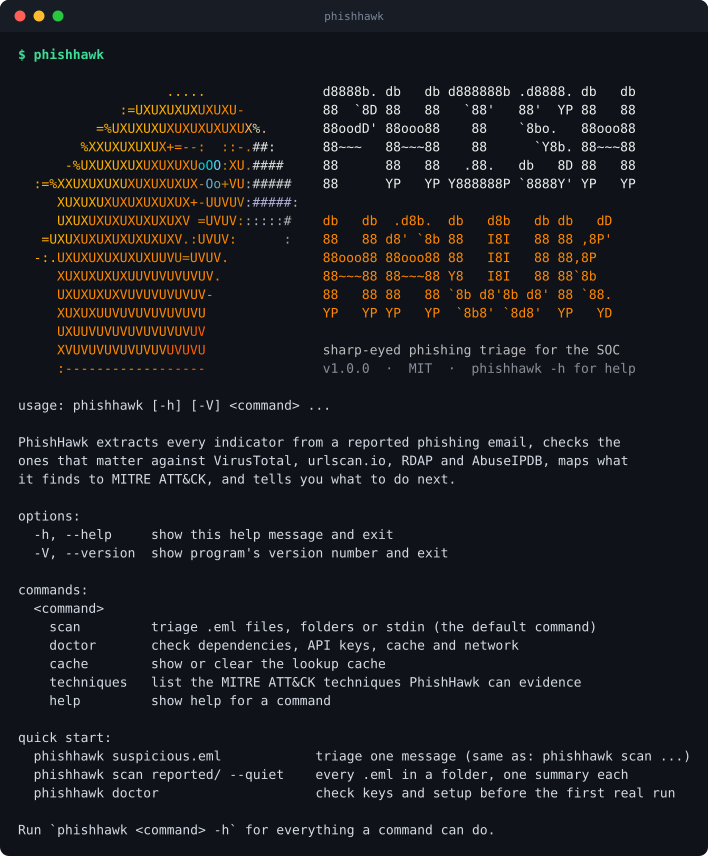
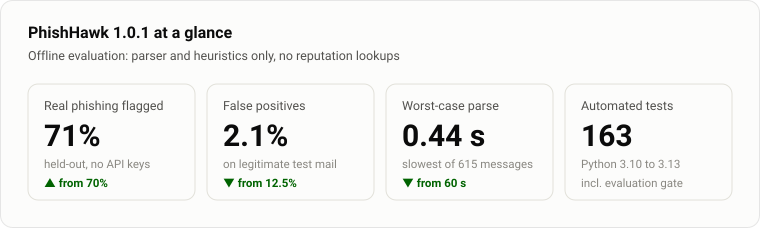
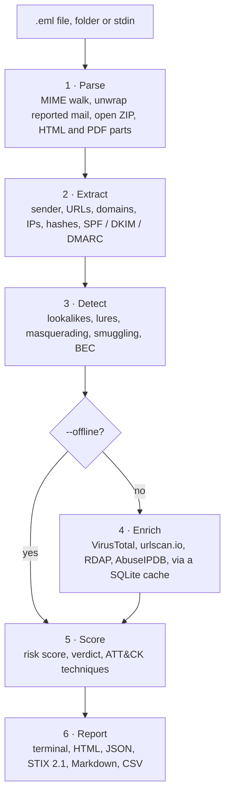
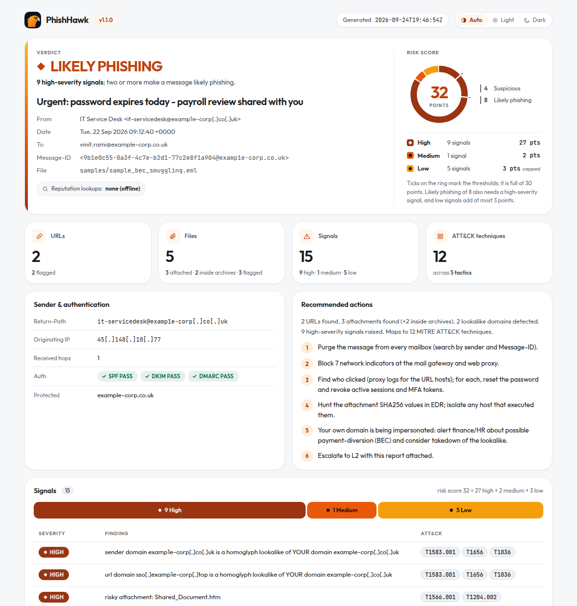
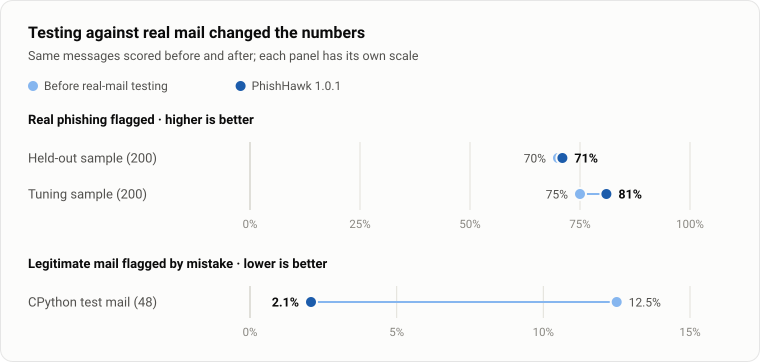
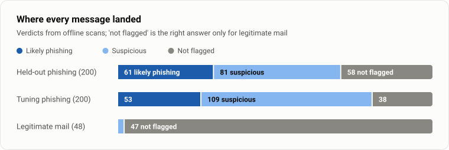

<p align="center">
  
</p>

<h1 align="center">PhishHawk</h1>

<p align="center">
  <b>Sharp-eyed phishing triage for the SOC.</b><br>
  Give it a reported email. It pulls out every indicator, checks the ones that matter,<br>
  maps what it finds to MITRE ATT&amp;CK and tells the analyst what to do next.
</p>

<p align="center">
  <a href="https://github.com/vinitrami-Soc/phishhawk/actions/workflows/ci.yml"></a>
  <a href="https://github.com/vinitrami-Soc/phishhawk/tags"></a>
  
  <a href="LICENSE"></a>
  
  
  
</p>

<p align="center">
  <a href="#installation">Install</a> ·
  <a href="#quick-start">Quick start</a> ·
  <a href="docs/USAGE.md">Usage guide</a> ·
  <a href="docs/DETECTIONS.md">Detections</a> ·
  <a href="docs/INTEGRATIONS.md">Integrations</a> ·
  <a href="eval/README.md">Evaluation</a> ·
  <a href="CHANGELOG.md">Changelog</a>
</p>

<p align="center">
  
</p>

## At a glance

<picture>
  <source media="(prefers-color-scheme: dark)" srcset="docs/images/chart-kpis-dark.svg">
  
</picture>

<sub>Measured offline, with no reputation lookups, on 200 held-out real phishing emails and 48 legitimate ones.
[How these numbers were measured](#tested-on-real-phishing).</sub>

## Contents

- [Why PhishHawk](#why-phishhawk)
- [What it does](#what-it-does)
- [How it works](#how-it-works)
- [Requirements](#requirements)
- [Installation](#installation)
- [Quick start](#quick-start)
- [Usage](#usage)
- [Reading the result](#reading-the-result)
- [Reports and exports](#reports-and-exports)
- [Best use cases](#best-use-cases)
- [Tested on real phishing](#tested-on-real-phishing)
- [MITRE ATT&CK coverage](#mitre-attck-coverage)
- [Privacy: what leaves your machine](#privacy-what-leaves-your-machine)
- [FAQ and troubleshooting](#faq-and-troubleshooting)
- [Limitations](#limitations)
- [Project layout](#project-layout)
- [Development](#development)
- [Roadmap](#roadmap)
- [Licence and credits](#licence-and-credits)

## Why PhishHawk

"I think this email is phishing" is the most common ticket in an L1 SOC queue,
and most of the work on it is the same every time. You copy the headers, defang
the links, hash the attachments, look each one up, check the sender domain,
write the summary and block the same kinds of indicators.

PhishHawk does that part in under a second, the same way every time, and
explains each finding. The analyst's time goes on the part that needs judgement.

| Doing it by hand | With PhishHawk |
|---|---|
| Open the `.eml` in a text editor and read the headers | `phishhawk suspicious.eml` |
| Spot `micros0ft` vs `microsoft` by eye | Homoglyph, typosquat, combosquat and TLD-swap engine, checked against 66 brands and your own domains |
| Unzip the attachment in a sandbox to see what is inside | ZIPs listed and hashed in memory; HTML attachments checked for credential forms and smuggling code |
| Paste each URL into VirusTotal, one at a time | Cached, rate-limited lookups, most suspicious indicators first |
| Write the ticket and the block list | HTML, Markdown, CSV, JSON and STIX 2.1 exports, all defanged |
| Work out which ATT&CK techniques apply | Every finding is tagged; 18 techniques covered |

## What it does

| Area | What PhishHawk checks |
|---|---|
| **Reported mail** | A phish forwarded as an attachment is unwrapped, up to three layers deep. For an ordinary inline forward, the original `From:` is recovered from the quoted header block in English, Portuguese, Spanish, German, French and Italian. |
| **Sender** | Reply-To and Return-Path diversion; a brand in the display name that the domain does not back up, even when written as `Trust-Wallet`; organisation-style names on free-mail addresses; SPF, DKIM and DMARC results. |
| **Lookalike domains** | Homoglyphs (`micros0ft`, Cyrillic `а`, `rn` for `m`), punycode, typosquats, combosquats, TLD swaps and brands used as subdomains. Checked against 66 brands and **your own domains**, which are read from the recipients automatically. |
| **Links** | Taken from text, HTML `href`/`src`, form actions, `meta refresh`, JavaScript redirects, headers and PDF annotations, including compressed streams. Microsoft Safe Links, Proofpoint and Barracuda rewrites are unwrapped, and Google, Bing, Facebook, YouTube and LinkedIn redirectors are decoded. Also flagged: link text that shows a different domain from the real target, raw IPs, `@` tricks, shorteners, free hosting, tunnels, IPFS, file-sharing drops and credential-harvesting paths. |
| **Attachments** | Every file is typed by its magic bytes, so a `.pdf` that is really HTML is caught as masquerading. Also flagged: double extensions, right-to-left-override names and risky types. ZIPs are opened in memory with zip-bomb caps; encrypted archives and VBA macro projects are flagged. |
| **HTML attachments** | Credential forms and where they post, smuggling code (`atob`, `Blob`, `createObjectURL`), redirects, and base64 strings that decode to URLs. |
| **Language** | Lure phrases in five languages (credentials, delivery, payment, prizes, advance fee, extortion); callback phishing (a fake renewal plus a phone number); QR-code lures; payment requests from free-mail accounts (BEC); letter-spaced text (`v e r i f y`); zero-width characters; hash-busting tokens; the recipient's address pasted into the subject or greeting. |
| **Reputation** *(optional)* | VirusTotal for URLs and file hashes, urlscan.io for hosts, RDAP for domain age, AbuseIPDB for the sending IP. All cached, rate-limited and switched off by `--offline`. |

The full list of signals, their severities and the ATT&CK techniques behind
each is in [docs/DETECTIONS.md](docs/DETECTIONS.md).

## How it works



1. **Parse.** The message is read with Python's standard `email` library. If the
   user reported it as an attachment, PhishHawk analyses the attached original,
   not the covering note. ZIP archives, HTML attachments and PDFs are opened in
   memory. Nothing is written to disk or executed.
2. **Extract.** Every sender field, URL, domain, IP, email address and
   attachment hash is collected, with a note of where each one came from.
3. **Detect.** Offline heuristics raise *signals*. Each signal has a severity
   (high, medium or low) and the ATT&CK techniques it is evidence of.
4. **Enrich** *(optional)*. Indicators that are not well-known brands or your
   own domains are checked against reputation services. Answers are cached for 24 hours.
5. **Score.** Signals add up to a risk score and one of four verdicts. The
   verdict decides the recommended actions and the exit code.
6. **Report.** One terminal report, plus any exports you asked for.

## Requirements

| Requirement | Details |
|---|---|
| **Python** | 3.10, 3.11, 3.12 or 3.13 (all four are tested in CI) |
| **Operating system** | Linux, macOS or Windows. `install.sh` needs a POSIX shell; on Windows use `pip` or Docker. |
| **Dependencies** | One: [`requests`](https://pypi.org/project/requests/), installed automatically. Everything else is the standard library. |
| **Disk** | About 250 KB of code, plus a small SQLite cache in `~/.cache/phishhawk/` |
| **Network** | None with `--offline`. Otherwise outbound HTTPS to the services below. |
| **Docker** *(optional)* | Any recent Docker. The image is based on `python:3.12-slim` and runs as an unprivileged user. |

**API keys are all optional.** Without any, PhishHawk still runs every offline
check, plus RDAP domain age and urlscan.io search, which need no key.

| Service | Environment variable | Free tier | Get a key | What it adds |
|---|---|---|---|---|
| VirusTotal | `VT_API_KEY` | Yes: 4 lookups a minute, 500 a day | [virustotal.com → API key](https://www.virustotal.com/gui/my-apikey) | URL and file-hash verdicts; the only route to a `MALICIOUS` verdict |
| AbuseIPDB | `ABUSEIPDB_API_KEY` | Yes: 1,000 checks a day | [abuseipdb.com → API](https://www.abuseipdb.com/account/api) | Reputation of the IP that sent the mail |
| urlscan.io | `URLSCAN_API_KEY` | Yes | [urlscan.io → profile → API keys](https://urlscan.io/user/profile/) | Only needed for `--urlscan-submit`; search works without it |

## Installation

### Option 1: the installer (recommended)

```bash
git clone https://github.com/vinitrami-Soc/phishhawk.git
cd phishhawk
./install.sh              # uses pipx if you have it, otherwise a private virtualenv; no root needed
phishhawk doctor          # checks Python, keys and cache before your first real run
```

The command goes in `~/.local/bin` and everything else in
`~/.local/share/phishhawk`. Set `PHISHHAWK_BIN` or `PHISHHAWK_HOME` to change
those. `./install.sh --uninstall` removes it again.

### Option 2: pipx or pip

```bash
pipx install git+https://github.com/vinitrami-Soc/phishhawk.git
# or, inside a virtualenv:
pip install git+https://github.com/vinitrami-Soc/phishhawk.git
```

### Option 3: Docker

```bash
docker build -t phishhawk .
docker run --rm -v "$PWD:/mail:ro" phishhawk suspicious.eml                               # read-only mount
docker run --rm --network none -v "$PWD:/mail:ro" phishhawk scan suspicious.eml --offline  # fully air-gapped
docker run --rm -e VT_API_KEY -v "$PWD:/mail" phishhawk scan mail.eml --html report.html  # write a report
```

The container runs as uid 10001, not root. If Docker Hub rate-limits you, build
with `--build-arg BASE=public.ecr.aws/docker/library/python:3.12-slim`.

### Option 4: no install

```bash
./phishhawk suspicious.eml      # straight from the checkout; needs `requests` importable
```

### Check the install

```console
$ phishhawk doctor
PhishHawk 1.0.0 doctor

  OK    Python             3.12.4
  OK    requests           2.32.3
                           used for enrichment
  OK    VirusTotal key     3f9a…c1 (VT_API_KEY)
  WARN  AbuseIPDB key      not set
                           export ABUSEIPDB_API_KEY=...   free key: https://www.abuseipdb.com/account/api
  --    urlscan.io key     not set
                           export URLSCAN_API_KEY=...   optional: search works without it
  --    Protected domains  recipients only
                           set PHISHHAWK_PROTECT=yourcompany.com to flag lookalikes of it
  OK    Cache              ~/.cache/phishhawk/lookups.sqlite3  (0 entries)
```

`phishhawk doctor --network` also checks that each reputation service can be reached.

## Quick start

```bash
# 1. Your keys and your company's domain (add these to ~/.bashrc to keep them)
export VT_API_KEY="your-virustotal-key"
export PHISHHAWK_PROTECT="yourcompany.com"

# 2. Try it on the bundled samples; they are inert and safe to open
phishhawk samples/sample_phish.eml

# 3. Triage a real report, saved from your mail client as .eml
phishhawk ~/Downloads/suspicious.eml --html report.html

# 4. A whole folder of user reports, one summary each
phishhawk scan reported/ --quiet
```

To save an email as `.eml`: in Gmail, open it and choose *⋮ → Download message*;
in Outlook on the web or the new Outlook, choose *… → Save as*; in Thunderbird,
*File → Save As → File*. See the [FAQ](#faq-and-troubleshooting) for classic
Outlook's `.msg` files.

## Usage

```text
phishhawk scan PATH...     triage .eml files, folders or stdin ('-'); the default command
phishhawk doctor           check dependencies, API keys, cache (and --network reachability)
phishhawk cache stats      show the lookup cache; also `cache clear [--provider rdap]`, `cache path`
phishhawk techniques       every MITRE ATT&CK technique PhishHawk can evidence (--json too)
phishhawk help scan        full help, with examples, environment variables and exit codes
```

The `scan` options you will use most:

| Option | What it does |
|---|---|
| `-o`, `--offline` | No network access at all; local analysis only |
| `-q`, `--quiet` / `-v`, `--verbose` | One summary block per message / every signal, MD5s and all actions |
| `-p`, `--protect DOMAIN` | Your organisation's domain (repeatable). Lookalikes of it are flagged as BEC, and it is never sent to third parties. |
| `--html`, `--json`, `--stix`, `--md`, `--csv PATH` | Write that report. `-` means stdout (not for HTML). |
| `--vt-rate N`, `--vt-budget N` | VirusTotal lookups per minute (default 4) and per message (default 20) |
| `--urlscan-submit` | Submit URLs to urlscan.io as unlisted scans. Off by default because it sends the full URL. |
| `--no-virustotal`, `--no-urlscan`, `--no-rdap`, `--no-abuseipdb` | Skip one provider |
| `--no-cache`, `--cache-ttl HOURS` | Bypass the cache, or change how long answers stay fresh (default 24) |
| `--no-unwrap` | Analyse the covering note instead of the attached, reported original |

```bash
phishhawk suspicious.eml                         # scan is the default command
cat suspicious.eml | phishhawk scan -            # read from stdin
phishhawk scan mail.eml --offline                # nothing leaves the machine
phishhawk scan mail.eml --html r.html --stix iocs.json --md ticket.md --csv block.csv
phishhawk scan mail.eml --json - | jq .verdict   # pure JSON on stdout, notices on stderr
```

The banner goes to stderr and only appears on an interactive terminal, so
piped output stays clean. [docs/USAGE.md](docs/USAGE.md) covers every option,
environment variable and exit code, with worked examples.

## Reading the result

<p align="center">
  
</p>

<sub>A real, unedited run, recorded from the CLI under a pseudo-terminal by
`python tools/make_demo.py`.</sub>

This sample is deliberately hard. **SPF, DKIM and DMARC all pass**, because the
attacker registered `examp1e-corp.co.uk` (digit one, not letter L) and set up
mail authentication properly. A filter that trusts authentication lets it
through. PhishHawk still flags it:

- the sender domain is a homoglyph of the recipient's own domain;
- the `.htm` attachment holds a credential form and HTML smuggling code;
- a base64 string inside that code decodes to a second phishing URL;
- a ZIP carries `Invoice_0923.pdf.js`, a script with a double extension;
- `Scan_0922.pdf` is really an HTML file.

### Verdicts

| Verdict | When | What PhishHawk recommends | Exit code |
|---|---|---|---|
| **NO STRONG INDICATORS** | None of the rules below | Close as benign unless the reporter describes harm; thank them | `0` |
| **SUSPICIOUS** | One high-severity signal, or a risk score of 4 or more | An analyst looks before closing | `1` |
| **LIKELY PHISHING** | Two high-severity signals, or one plus a score of 8 or more | Purge from mailboxes, block the indicators, find who clicked, escalate | `1` |
| **MALICIOUS** | Two or more VirusTotal engines flag a URL or attachment | Treat as an incident: purge, block, reset credentials, hunt the hashes in EDR | `2` |

Signals weigh 3 (high), 2 (medium) or 1 (low). Low signals add **at most 3
points between them**, so a missing authentication header plus a bounce address
at an email provider never add up to a verdict on their own. Exit code `3`
means an input could not be read or a report could not be written.

## Reports and exports

| Flag | Best for | Notes |
|---|---|---|
| *(default)* | The analyst | Colour terminal report. `--quiet` gives one block per mail; `--verbose` shows everything. |
| `--html PATH` | The ticket, L2, a manager | Self-contained, light and dark themes. A strict Content-Security-Policy blocks scripts and network access, every value is escaped, and malicious URLs are never clickable. |
| `--json PATH` | SOAR playbooks, scripts | Verdict, score, signals, techniques, indicators and actions. Message bodies are left out. |
| `--stix PATH` | MISP, OpenCTI, Sentinel TI | STIX 2.1 bundle, validated against the official `stix2` library in CI. IDs are deterministic, so one URL reported by fifty users imports as one indicator. |
| `--md PATH` | Jira, ServiceNow, TheHive | Ticket note with a defanged indicator table and an action checklist |
| `--csv PATH` | Blocklists, SIEM watchlists | One row per indicator. Cells are protected against spreadsheet formula injection. |

<picture>
  <source media="(prefers-color-scheme: dark)" srcset="docs/images/report-dark.png">
  
</picture>

Exports never list well-known brand domains, your own domains, URL shorteners
or free-mail providers as domain-level blocks, because blocking `bit.ly` or
`google.com` would do more harm than the phish. The specific URL is still
exported, so a Google Drive link can be blocked without blocking Drive.
[docs/INTEGRATIONS.md](docs/INTEGRATIONS.md) shows how to load each format into
MISP, OpenCTI, Splunk, Sentinel, TheHive and SOAR platforms.

## Best use cases

### 1. L1 triage of user-reported phishing

The core job. A user clicks "Report phishing", the `.eml` lands in a queue, and
the analyst runs one command and attaches the reports to the ticket.

```bash
phishhawk reported/ticket-4821.eml --html ticket-4821.html --md ticket-4821.md
```

### 2. A campaign that hit many inboxes

Fifty people report the same lure. Scan the folder: the cache means each unique
URL and hash is looked up only once, and the batch summary lists every report
side by side with its verdict and score.

```bash
phishhawk scan reported/2026-09-23/ --quiet --csv campaign-iocs.csv
```

### 3. BEC and lookalikes of your own domain

Tell PhishHawk your domains. `examp1e.com`, `example-payments.com` and
`example.co` are then flagged as impersonation, even when SPF, DKIM and DMARC
all pass.

```bash
export PHISHHAWK_PROTECT="example.com,example.co.uk"
phishhawk invoice-change-request.eml
```

### 4. Sharing threat intelligence

Export a STIX 2.1 bundle and import it into MISP or OpenCTI. Deterministic IDs
mean repeated imports do not create duplicates.

```bash
phishhawk scan reported/ --stix bundle.json
```

### 5. SOAR playbooks and mailbox automation

Pure JSON on stdout plus meaningful exit codes make PhishHawk easy to call from
a playbook, a cron job or a mailbox-polling script.

```bash
phishhawk scan "$EML" --json - > result.json
case $? in 0) close_ticket ;; 1) assign_to_analyst ;; 2) open_incident ;; esac
```

### 6. Air-gapped or privacy-sensitive analysis

For legal, HR or executive mail that must not leave the building, run fully
offline inside a container with no network at all.

```bash
docker run --rm --network none -v "$PWD:/mail:ro" phishhawk scan mail.eml --offline
```

### 7. Training and awareness

The bundled samples and the HTML report make good teaching material. They show
*why* a message is phishing, in plain language, with each finding tied to a
MITRE ATT&CK technique.

### When PhishHawk is not the right tool

- **As an inline mail filter.** It analyses messages after delivery. It does not
  sit in the mail flow or block anything by itself.
- **For detonating malware.** Attachments are typed, hashed and inspected
  statically. Use a sandbox for dynamic analysis.
- **As a spam filter.** It targets credential theft, malware delivery,
  impersonation and BEC, not casino adverts.

## Tested on real phishing

Every number below is **offline**, with no reputation lookups, so it measures
the parser and heuristics alone. With VirusTotal, RDAP and AbuseIPDB switched
on, detection can only go up.

<picture>
  <source media="(prefers-color-scheme: dark)" srcset="docs/images/chart-evaluation-dark.svg">
  
</picture>

<picture>
  <source media="(prefers-color-scheme: dark)" srcset="docs/images/chart-verdicts-dark.svg">
  
</picture>

| Data set | Emails | Flagged | Strict | False positives | Median time |
|---|---|---|---|---|---|
| Real phishing, **held-out** sample of the [phishing_pot](https://github.com/rf-peixoto/phishing_pot) honeypot corpus | 200 | **71.0%** | 30.5% | – | 10.7 ms |
| Real phishing, sample used while developing detections | 200 | 81.0% | 26.5% | – | 10.4 ms |
| Legitimate and edge-case mail (CPython email test corpus) | 48 | – | – | **2.1%** (1 of 48) | 3.4 ms |
| Labelled synthetic corpus, including tricky legitimate mail | 167 | 100% | 59.8% | 0.0% | 3.7 ms |

*Flagged* means `SUSPICIOUS` or worse; *strict* means `LIKELY PHISHING` or worse.

**The held-out number is the honest one.** Those 200 messages were scored once,
at the end, after all tuning was finished. The honeypot also labels a lot of
plain spam (casino offers, diet pills) as phishing, which PhishHawk deliberately
leaves alone. Running real mail found a regex that took **60 seconds** on one
message (now under half a second) and cut false positives from 12.5% to 2.1%.
[eval/README.md](eval/README.md) has the method, the caveats and the commands to
reproduce every number; the raw figures are in
[eval/results.json](eval/results.json).

## MITRE ATT&CK coverage

`phishhawk techniques` lists all 18 techniques and what evidences each. A report
lists only the techniques seen in that message, each linked to the signals behind it.

| Technique | Evidence PhishHawk looks for |
|---|---|
| [T1566](https://attack.mitre.org/techniques/T1566/) Phishing, [.001](https://attack.mitre.org/techniques/T1566/001/) Attachment, [.002](https://attack.mitre.org/techniques/T1566/002/) Link | urgency wording; risky, archived, macro-enabled or VirusTotal-flagged files; link text that shows one domain and points at another; QR-code lures |
| [T1598.002](https://attack.mitre.org/techniques/T1598/002/), [.003](https://attack.mitre.org/techniques/T1598/003/) Phishing for Information | credential forms in HTML attachments; credential-harvesting paths such as `/login` or `/owa` on untrusted hosts |
| [T1656](https://attack.mitre.org/techniques/T1656/) Impersonation | brand display names, Reply-To diversion, lookalikes of brands or your domain, free-mail BEC |
| [T1036](https://attack.mitre.org/techniques/T1036/), [.002](https://attack.mitre.org/techniques/T1036/002/), [.007](https://attack.mitre.org/techniques/T1036/007/), [.008](https://attack.mitre.org/techniques/T1036/008/) Masquerading | homoglyph hosts, `@` tricks, right-to-left override, `invoice.pdf.js`, magic bytes that contradict the extension |
| [T1027](https://attack.mitre.org/techniques/T1027/), [.006](https://attack.mitre.org/techniques/T1027/006/), [.013](https://attack.mitre.org/techniques/T1027/013/) Obfuscation | zero-width text, base64-hidden URLs, HTML smuggling, password-protected archives |
| [T1583.001](https://attack.mitre.org/techniques/T1583/001/), [.006](https://attack.mitre.org/techniques/T1583/006/) Acquire Infrastructure | lookalike, punycode, high-abuse-TLD and newly registered domains; free hosting, tunnels, IPFS, file sharing |
| [T1608.005](https://attack.mitre.org/techniques/T1608/005/) Link Target | URL shorteners, raw-IP hosts, HTML redirects |
| [T1204.001](https://attack.mitre.org/techniques/T1204/001/), [.002](https://attack.mitre.org/techniques/T1204/002/) User Execution | the links and files the lure pushes the recipient towards |

## Privacy: what leaves your machine

| Source | Key | What is sent | Default |
|---|---|---|---|
| VirusTotal | `VT_API_KEY` | A URL's identifier and a file's SHA-256. **Files are never uploaded.** | On when a key is set |
| urlscan.io | none (key only to submit) | The hostname only. `--urlscan-submit` sends the full URL as an *unlisted* scan, and only when you ask. | Search on |
| RDAP | none | The registered domain, to find its creation date | On |
| AbuseIPDB | `ABUSEIPDB_API_KEY` | The IP address that sent the mail | On when a key is set |

- **Never sent anywhere:** message bodies, attachments, recipient addresses,
  your protected domains and well-known brand domains.
- `--offline` sends nothing at all. `--no-<provider>` switches off one service.
- Answers are cached in SQLite for 24 hours; errors are never cached.
  `phishhawk cache clear` empties the cache.
- VirusTotal is paced to the free tier's 4 requests a minute and capped at 20 per
  message, with the most suspicious indicators looked up first.

## FAQ and troubleshooting

<details>
<summary><b>Classic Outlook gives me a <code>.msg</code> file, not <code>.eml</code>.</b></summary>

`.msg` is not supported yet. Either open the message in Outlook on the web and
use *… → Save as*, which saves an `.eml`, or convert the file with `msgconvert`
(package `libemail-outlook-message-perl` on Debian and Ubuntu):
`msgconvert suspicious.msg && phishhawk suspicious.eml`.
</details>

<details>
<summary><b>The verdict is <code>NO STRONG INDICATORS</code>, but I know it is phishing.</b></summary>

Run it again with a VirusTotal key and without `--offline`: a domain registered
last week or a known-bad URL often makes the difference. Add `--verbose` to see
every signal, including the low ones. If it still misses, please open a
[detection report](https://github.com/vinitrami-Soc/phishhawk/issues/new/choose)
describing the message (not the raw email).
</details>

<details>
<summary><b>A legitimate newsletter or alert was flagged.</b></summary>

Look at which signals fired with `--verbose`. Most false positives come from a
legitimate sender that behaves like a phisher, such as a password-reset email
sent through a third-party service. Report it with the detection template so the
rule can be tuned.
</details>

<details>
<summary><b>VirusTotal says "no record" for a URL.</b></summary>

Nobody has submitted that exact URL yet. For a phishing link that usually means
fresh infrastructure, not a clean one. PhishHawk never submits anything to
VirusTotal itself.
</details>

<details>
<summary><b>I keep hitting VirusTotal's rate limit.</b></summary>

PhishHawk already paces itself to 4 lookups a minute. Across a big batch, lower
the per-message budget (`--vt-budget 5`) and let the cache work: a repeated
indicator costs nothing. With a premium key, raise `--vt-rate`.
</details>

<details>
<summary><b><code>phishhawk: command not found</code> after installing.</b></summary>

`~/.local/bin` is not on your `PATH`. Add `export PATH="$HOME/.local/bin:$PATH"`
to `~/.bashrc` or `~/.zshrc` and open a new terminal.
</details>

<details>
<summary><b>Is it safe to scan real malware?</b></summary>

PhishHawk never executes, renders or writes attachments to disk. Archives are
read in memory with caps on member count (200), member size (25 MB) and total
size (100 MB); PDF streams are inflated with a 20 MB cap. For extra isolation,
use the Docker image with `--network none` and a read-only mount.
</details>

<details>
<summary><b>How do I turn off colours or the banner?</b></summary>

`--no-color` or `NO_COLOR=1` for colours; `--no-banner` or
`PHISHHAWK_NO_BANNER=1` for the banner. Neither appears when output is piped.
</details>

## Limitations

- Outlook `.msg` files are not read; convert them to `.eml` first.
- QR codes are recognised from the lure wording, not decoded, so the URL inside
  one is not extracted.
- Only ZIP archives are opened. RAR, 7z and ISO files are typed and flagged but not unpacked.
- The registered-domain logic approximates the public suffix list rather than
  shipping it.
- Heuristics trade recall against false positives. Before relying on PhishHawk,
  run `eval/run_eval.py --benign` on a few hundred of your own legitimate emails.

## Project layout

```text
phishhawk/
├── src/phishhawk/
│   ├── cli.py          scan / doctor / cache / techniques / help
│   ├── banner.py       start-up banner (_logo_art.py is generated from docs/images/logo.svg)
│   ├── parse.py        MIME walk, unwrapping, inline forwards, archives, HTML and PDF parts
│   ├── extract.py      refang/defang, link unwrapping, URL/HTML/PDF extraction, magic bytes
│   ├── lookalike.py    homoglyph / typosquat / combosquat / TLD-swap engine
│   ├── heuristics.py   every signal, its severity and ATT&CK tags
│   ├── hosting.py      free hosting, tunnels, IPFS and file-sharing links
│   ├── knowledge.py    brands, lure phrases, TLDs, shorteners, free-mail, risky extensions
│   ├── attack.py       the ATT&CK technique catalogue
│   ├── models.py       Analysis, indicators, scoring, IOC export policy
│   ├── cache.py        SQLite TTL cache
│   ├── enrich/         VirusTotal, urlscan.io, RDAP, AbuseIPDB
│   ├── report/         console, HTML, STIX, Markdown, CSV
│   └── pipeline.py     parse → detect → enrich
├── tests/              163 offline tests, including the evaluation gate
├── samples/            four inert sample emails and the script that makes them
├── eval/               labelled corpus, evaluation runner, real-corpus fetcher, results.json
├── tools/              scripts that draw the logo, banner, demo and charts in docs/images
├── docs/               usage, detections and integrations guides; images
├── install.sh          user-level installer (pipx or virtualenv)
├── Dockerfile          non-root image
└── phishhawk           run-from-checkout launcher
```

## Development

```bash
git clone https://github.com/vinitrami-Soc/phishhawk.git && cd phishhawk
python -m venv .venv && . .venv/bin/activate
pip install -e ".[dev]"

pytest                                       # 163 tests, offline, a few seconds
ruff check src tests samples eval tools phishhawk
python eval/run_eval.py --synthetic          # the labelled-corpus regression gate
```

CI runs lint, the tests and CLI smoke tests on Python 3.10 to 3.13, installs and
uninstalls through `install.sh`, and builds and runs the Docker image with
`--network none`. To regenerate the images in `docs/images`, install the
`assets` extra and run the scripts in `tools/`. [CONTRIBUTING.md](CONTRIBUTING.md)
explains how to add a detection.

## Roadmap

- [ ] Read Outlook `.msg` files directly
- [ ] Decode QR codes in images and PDFs
- [ ] Open RAR, 7z and ISO containers
- [ ] Pull reported mail straight from Microsoft 365 or Gmail through their APIs
- [ ] Optional full public suffix list
- [ ] More brands and lure languages

Ideas are welcome as [feature requests](https://github.com/vinitrami-Soc/phishhawk/issues/new/choose).

## Licence and credits

PhishHawk is released under the [MIT licence](LICENSE). Built by
[Vinit Rami](https://github.com/vinitrami-Soc), alongside an MSc dissertation
on phishing detection.

- Real-phishing evaluation uses [phishing_pot](https://github.com/rf-peixoto/phishing_pot)
  by rf-peixoto (CC BY-NC 4.0). It is fetched on demand for non-commercial
  evaluation and never redistributed here.
- Legitimate test mail comes from CPython's `Lib/test/test_email/data` (PSF licence).
- Banner lettering uses the figlet `basic` font.
- Technique names and IDs are from [MITRE ATT&CK®](https://attack.mitre.org/).

Found a security issue in PhishHawk itself? Please follow [SECURITY.md](SECURITY.md)
rather than opening a public issue.
