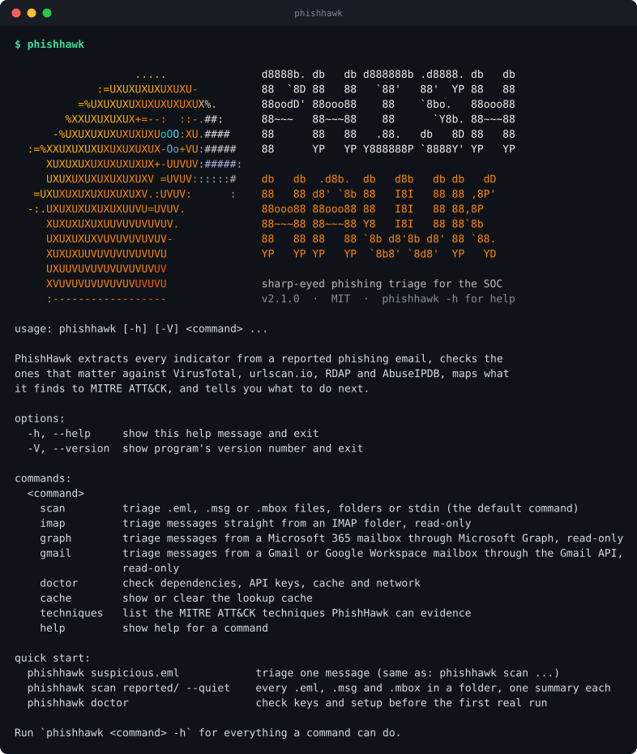
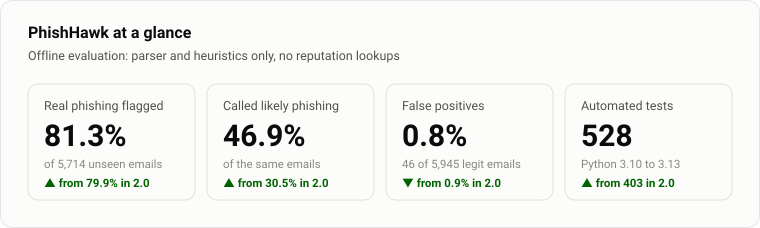
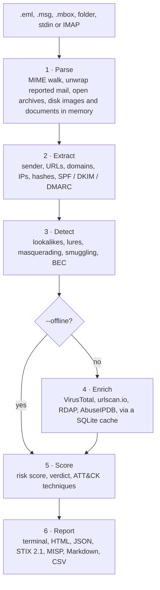
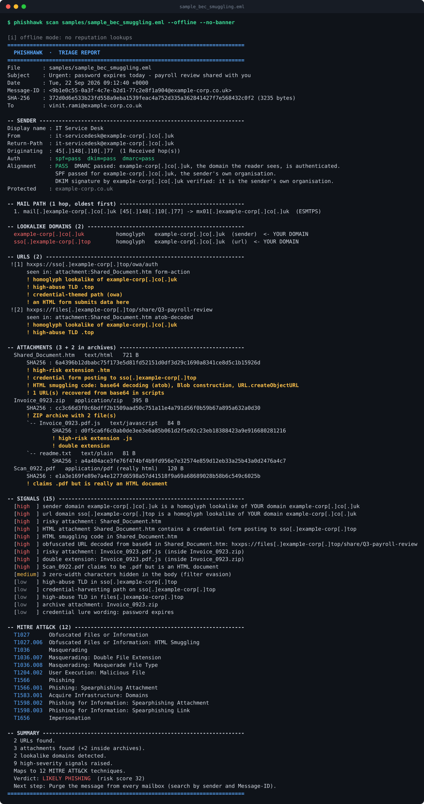
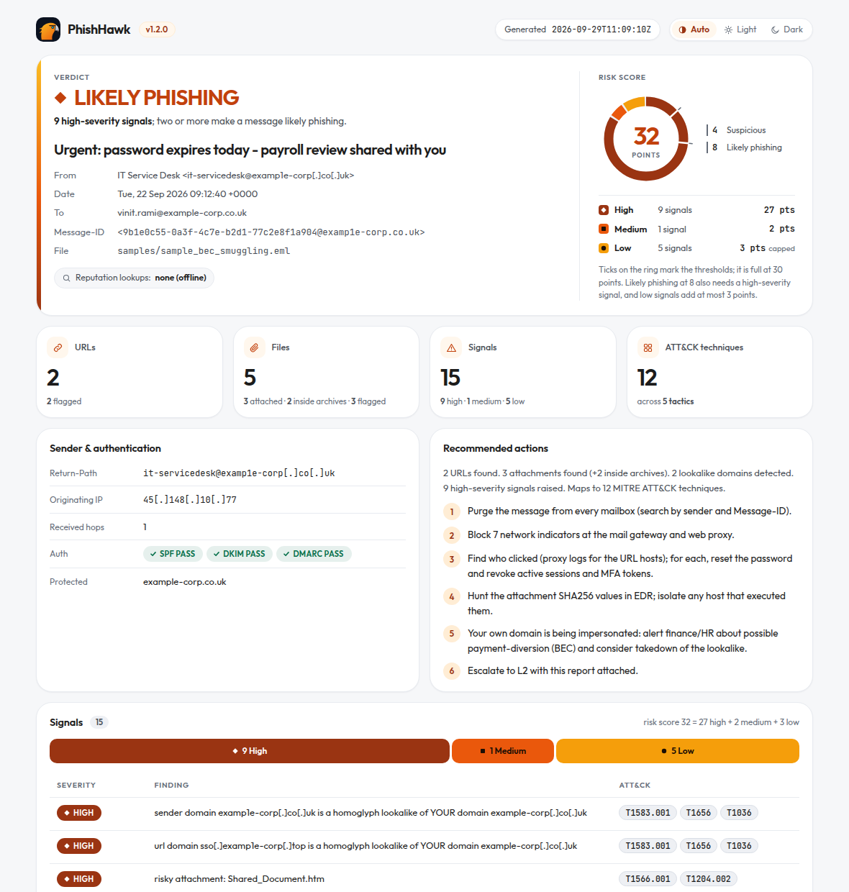
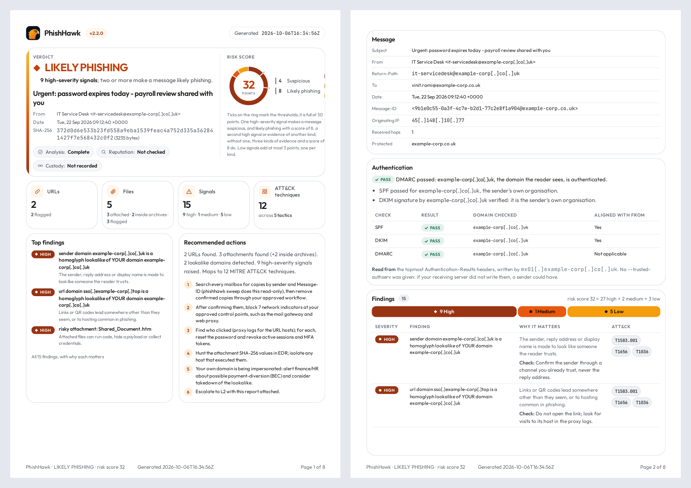
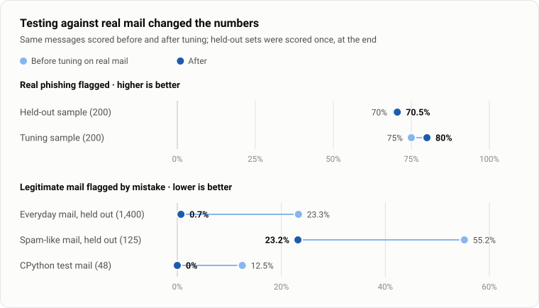
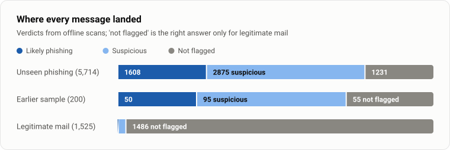

<p align="center">
  
</p>

<h1 align="center">PhishHawk</h1>

<p align="center">
  <b>Phishing email triage tool for SOC analysts.</b><br>
  Give it a reported email. It pulls out every indicator, checks the ones that matter,<br>
  maps what it finds to MITRE ATT&amp;CK and tells the analyst what to do next.
</p>

<p align="center">
  <a href="https://github.com/vinitrami-Soc/phishhawk/actions/workflows/ci.yml"></a>
  <a href="https://github.com/vinitrami-Soc/phishhawk/tags"></a>
  
  <a href="LICENSE"></a>
  
  
  
</p>

<p align="center">
  <a href="#installation">Install</a> ·
  <a href="#quick-start">Quick start</a> ·
  <a href="docs/USAGE.md">Usage guide</a> ·
  <a href="docs/DETECTIONS.md">Detections</a> ·
  <a href="docs/INTEGRATIONS.md">Integrations</a> ·
  <a href="eval/README.md">Evaluation</a> ·
  <a href="CHANGELOG.md">Changelog</a>
</p>

| | |
|---|---|
| **What** | A command-line tool that triages reported phishing emails: a verdict, every indicator (defanged), the ATT&CK techniques and the next steps, in under a second |
| **For** | SOC analysts, incident responders and threat-intelligence teams working a "report phishing" queue |
| **Reads** | `.eml`, Outlook `.msg`, `.mbox`, folders and stdin; report mailboxes over IMAP, Microsoft Graph and the Gmail API, read-only |
| **Finds** | Lookalike and spoofed senders, credential-phishing links, QR-code phishing, malicious attachments (opened in memory, never run), BEC and callback scams |
| **Writes** | Terminal, HTML, Markdown, JSON, CSV, STIX 2.1 and MISP reports; campaign and mailbox-sweep results; an evidence custody log; sandbox packs |

```text
$ phishhawk scan samples/sample_benign.eml samples/sample_phish.eml --quiet --offline
== samples/sample_benign.eml
  1 URL found.
  Verdict: NO STRONG INDICATORS (risk score 0)

== samples/sample_phish.eml
  6 URLs found.
  1 attachment found.
  1 lookalike domain detected.
  9 high-severity signals raised.
  Maps to 10 MITRE ATT&CK techniques.
  Verdict: LIKELY PHISHING (risk score 35)

-- BATCH SUMMARY (2 messages) --------------------------------------------
  file                                   verdict               score  urls files
  samples/sample_benign.eml              NO STRONG INDICATORS      0     1     0
  samples/sample_phish.eml               LIKELY PHISHING          35     6     1
```

<p align="center">
  
</p>

<p align="center">
  
</p>

## At a glance

<picture>
  <source media="(prefers-color-scheme: dark)" srcset="docs/images/chart-kpis-dark.svg">
  
</picture>

<sub>Measured offline, with no reputation lookups, on held-out real mail scored once after all tuning: 5,714
phishing emails from 2022 to 2026 and 5,945 legitimate ones. [How these numbers were measured](#tested-on-real-mail).</sub>

## Contents

- [Why PhishHawk](#why-phishhawk)
- [What it does](#what-it-does)
- [How it works](#how-it-works)
- [Requirements](#requirements)
- [Installation](#installation)
- [Quick start](#quick-start)
- [Usage](#usage)
- [Reading the result](#reading-the-result)
- [Reports and exports](#reports-and-exports)
- [Best use cases](#best-use-cases)
- [Tested on real mail](#tested-on-real-mail)
- [MITRE ATT&CK coverage](#mitre-attck-coverage)
- [Privacy: what leaves your machine](#privacy-what-leaves-your-machine)
- [FAQ and troubleshooting](#faq-and-troubleshooting)
- [Limitations](#limitations)
- [Project layout](#project-layout)
- [Development](#development)
- [Roadmap](#roadmap)
- [Licence and credits](#licence-and-credits)

## Why PhishHawk

"I think this email is phishing" is the most common ticket in an L1 SOC queue,
and most of the work on it is the same every time. You copy the headers, defang
the links, hash the attachments, look each one up, check the sender domain,
write the summary and block the same kinds of indicators.

PhishHawk does that part in under a second, the same way every time, and
explains each finding. The analyst's time goes on the part that needs judgement.

| Doing it by hand | With PhishHawk |
|---|---|
| Open the `.eml` or `.msg` in a text editor and read the headers | `phishhawk suspicious.eml`, or `phishhawk imap` on the report mailbox |
| Spot `micros0ft` vs `microsoft` by eye | Homoglyph, typosquat, combosquat and TLD-swap engine, checked against 187 brands and your own domains |
| Unpack the attachment in a sandbox to see what is inside | ZIP, RAR, 7z, ISO, disk images, Office, PDF, RTF, OneNote and shortcut files read in memory, never run |
| Paste each URL into VirusTotal, one at a time | Cached, rate-limited lookups, most suspicious indicators first |
| Write the ticket and the block list | HTML, Markdown, CSV, JSON, STIX 2.1 and MISP exports, all defanged where people read them |
| Work out which ATT&CK techniques apply | Every finding is tagged; 29 techniques covered |

## What it does

| Area | What PhishHawk checks |
|---|---|
| **Reported mail** | Reads `.eml` and Outlook `.msg` files, folders, `.mbox` exports, and report mailboxes directly, read-only: over IMAP (`phishhawk imap`) or through Microsoft Graph and the Gmail API (`phishhawk graph`, `phishhawk gmail`). A phish forwarded as an attachment is unwrapped, up to three layers deep; every layer is analysed too, and emails attached deeper or beside it are still read, so a phish cannot hide behind a harmless attached message. For an inline forward, the original `From:` is recovered from the quoted header block in six languages. The mail path (every Received hop, with delays) is shown. |
| **Sender** | Reply-To diversion; a brand in the display name that the domain does not back up, even when written `Trust-Wallet`, `PayPaI` or with Cyrillic letters; a brand's own domain in the From line without the authentication to back it (a forged sender); a From address hidden in quotes; senders on free web hosting; organisation-style names on free-mail; SPF, DKIM and DMARC believed only from your own mail server, with a pass forged further down flagged. Every report explains, in sentences for a ticket, whether the From domain is authenticated: which domain each check vouched for and whether it is the sender the reader sees. |
| **Lookalike domains** | Homoglyphs (`micros0ft`, Cyrillic `а`, `rn` for `m`), punycode, typosquats, combosquats, TLD swaps and brands used as subdomains. Checked against 187 brands, any you add, and **your own domains**, read from the recipients automatically. With `--psl`, the full Public Suffix List decides what a registrable domain is, so a lookalike on shared hosting (`paypal-billing.github.io`) is its own domain. |
| **Links** | Taken from text, HTML `href`/`src`, form actions, `meta refresh`, JavaScript redirects, headers, PDFs, Office relationships, shortcuts, calendar invitations and QR codes, read the way a browser reads them. Microsoft Safe Links, Proofpoint and Barracuda rewrites are unwrapped, and Google, Bing, Facebook, YouTube and LinkedIn redirectors are decoded. Also flagged: link text that shows a different domain, raw and disguised IPs (`http://3232235777/`), `@` tricks, `javascript:` and `data:` links, downloads of runnable files, shorteners, free hosting, tunnels, IPFS, file-sharing drops and credential-harvesting paths. |
| **Attachments** | Every file is typed by its magic bytes, so a `.pdf` that is really HTML is caught. ZIP, gzip and tar are opened; 7z is decompressed in memory and RAR's stored files read, and both are listed even with encrypted headers; ISO, FAT and VHD/VHDX disk images are opened, partitions, FAT and NTFS volumes and all (their files skip the Mark of the Web); a password-protected ZIP is opened when the message gives the password. Office macros, XLM, DDE, remote templates and Follina-style links, PDF launch and JavaScript actions, RTF exploits, OneNote payloads, dangerous shortcuts, `winmail.dat` and calendar invitations are all read, in memory, and nothing is ever run. |
| **HTML and SVG attachments** | Credential forms and where they post, smuggling code (`atob`, `Blob`, `createObjectURL`), SVG images that run script, redirects, and base64 strings that decode to URLs. |
| **Evasion** | Text hidden with CSS to break up words or to feed filters filler, words split by tags, styled-Unicode and invisible characters in the subject, mixed alphabets, MIME nested past any mail client, link floods, and headers built to crash or stall mail parsers. |
| **QR codes** *(optional extra)* | Decoded in image attachments, inline images, images embedded in the HTML, images inside PDFs, and codes drawn with table cells or block characters. The link inside is analysed like any other; a code leading somewhere suspect, or sent with a credential or MFA ask, is high. |
| **Language and money** | Lure phrases in seven languages (credentials, delivery, payment, prizes, advance fee, extortion, crypto recovery, casino bonuses); callback phishing, with the number to call exported; crypto wallets (checksum-verified) and payment asks; business email compromise from free-mail or from a lookalike of your own domain; QR-code lure wording; letter-spaced text; hash-busting tokens. |
| **Your rules** | A config file for your domains, partners (never flagged), a block list, your own brands and lure phrases, and your YARA rules, run on the message and every file inside it. |
| **Reputation** *(optional)* | VirusTotal for URLs and file hashes, urlscan.io for hosts, RDAP for domain age, AbuseIPDB for the sending IP. All cached, rate-limited and switched off by `--offline`. |
| **After triage** | `phishhawk campaign` groups a folder of reports into campaigns by shared attachments, phishing domains, links, QR payloads and senders, with each campaign's recipients and first and last sighting, offline. `phishhawk sweep` finds a reported message's other copies in Microsoft 365 or Gmail mailboxes, with whether each was read or replied to, read-only. `--sandbox` writes a pack for any sandbox: the message, every file in it and the links to detonate, encrypted with the password `infected`. |
| **Evidence** | Every report names the SHA-256 of the exact bytes it analysed. `--evidence` keeps each message, read-only, with a hash-chained custody log; `phishhawk evidence verify --head` shows whether anything changed since the head you put in the ticket. |

The full list of signals, their severities and the ATT&CK techniques behind
each is in [docs/DETECTIONS.md](docs/DETECTIONS.md).

## How it works

<p align="center">
  
</p>


```mermaid
flowchart TD
    IN[".eml, .msg, .mbox, folder, stdin or IMAP"] --> P["1 · Parse<br/>MIME walk, unwrap reported mail, open archives, disk images and documents in memory"]
    P --> X["2 · Extract<br/>sender, URLs, domains, IPs, hashes, SPF / DKIM / DMARC"]
    X --> D["3 · Detect<br/>lookalikes, lures, masquerading, smuggling, BEC"]
    D --> Q{"--offline?"}
    Q -- "no" --> E["4 · Enrich<br/>VirusTotal, urlscan.io, RDAP, AbuseIPDB, via a SQLite cache"]
    Q -- "yes" --> S
    E --> S["5 · Score<br/>risk score, verdict, ATT&CK techniques"]
    S --> R["6 · Report<br/>terminal, HTML, JSON, STIX 2.1, MISP, Markdown, CSV"]
```

1. **Parse.** The message is read with Python's standard `email` library,
   hardened against headers written to break it; an Outlook `.msg` is rebuilt as
   the email it was sent as. If the user reported it as an attachment, PhishHawk
   analyses the attached original, not the covering note. Archives, disk images,
   documents and HTML attachments are opened in memory, by readers written for
   hostile input with a budget on every read. Nothing is written to disk or executed.
2. **Extract.** Every sender field, URL, domain, IP, email address and
   attachment hash is collected, with a note of where each one came from.
3. **Detect.** Offline heuristics raise *signals*. Each signal has a severity
   (high, medium or low) and the ATT&CK techniques it is evidence of.
4. **Enrich** *(optional)*. Indicators that are not well-known brands or your
   own domains are checked against reputation services. Answers are cached for 24 hours.
5. **Score.** Signals add up to a risk score and one of four verdicts. The
   verdict decides the recommended actions and the exit code.
6. **Report.** One terminal report, plus any exports you asked for.

## Requirements

| Requirement | Details |
|---|---|
| **Python** | 3.10, 3.11, 3.12 or 3.13 (all four are tested in CI) |
| **Operating system** | Linux, macOS or Windows. `install.sh` needs a POSIX shell; on Windows use `pip` or Docker. |
| **Dependencies** | One: [`requests`](https://pypi.org/project/requests/), installed automatically. Everything else, the `.msg`, RAR, 7z, ISO and Office readers included, is the standard library. Optional extras: `[qr]` for QR codes, `[yara]` for YARA rules. |
| **Disk** | About 560 KB of code and 100 KB of report fonts, plus a small SQLite cache in `~/.cache/phishhawk/` |
| **Network** | None with `--offline`. Otherwise outbound HTTPS to the services below. |
| **Docker** *(optional)* | Any recent Docker. The image is based on `python:3.12-slim` and runs as an unprivileged user. |

**API keys are all optional.** Without any, PhishHawk still runs every offline
check, plus RDAP domain age and urlscan.io search, which need no key.

| Service | Environment variable | Free tier | Get a key | What it adds |
|---|---|---|---|---|
| VirusTotal | `VT_API_KEY` | Yes: 4 lookups a minute, 500 a day | [virustotal.com → API key](https://www.virustotal.com/gui/my-apikey) | URL and file-hash verdicts; the only route to a `MALICIOUS` verdict |
| AbuseIPDB | `ABUSEIPDB_API_KEY` | Yes: 1,000 checks a day | [abuseipdb.com → API](https://www.abuseipdb.com/account/api) | Reputation of the IP that sent the mail |
| urlscan.io | `URLSCAN_API_KEY` | Yes | [urlscan.io → profile → API keys](https://urlscan.io/user/profile/) | Only needed for `--urlscan-submit`; search works without it |

## Installation

### Option 1: the installer (recommended)

```bash
git clone https://github.com/vinitrami-Soc/phishhawk.git
cd phishhawk
./install.sh              # uses pipx if you have it, otherwise a private virtualenv; no root needed
phishhawk doctor          # checks Python, keys and cache before your first real run
```

The command goes in `~/.local/bin` and everything else in
`~/.local/share/phishhawk`. Set `PHISHHAWK_BIN` or `PHISHHAWK_HOME` to change
those. `./install.sh --uninstall` removes it again.

### Option 2: pipx or pip

```bash
pipx install "phishhawk[qr] @ git+https://github.com/vinitrami-Soc/phishhawk.git"
# or, inside a virtualenv:
pip install "phishhawk[qr] @ git+https://github.com/vinitrami-Soc/phishhawk.git"
```

The `[qr]` extra adds QR-code decoding (zxing-cpp and Pillow, both with ready-made
wheels for Linux, macOS and Windows). Leave it out for the smallest install:
everything else works, and QR-code lure wording is still flagged.

### Option 3: Docker

```bash
docker build -t phishhawk .
docker run --rm -v "$PWD:/mail:ro" phishhawk suspicious.eml                               # read-only mount
docker run --rm --network none -v "$PWD:/mail:ro" phishhawk scan suspicious.eml --offline  # fully air-gapped
docker run --rm -e VT_API_KEY -v "$PWD:/mail" phishhawk scan mail.eml --html report.html  # write a report
```

The container runs as uid 10001, not root. If Docker Hub rate-limits you, build
with `--build-arg BASE=public.ecr.aws/docker/library/python:3.12-slim`.

### Option 4: no install

```bash
./phishhawk suspicious.eml      # straight from the checkout; needs `requests` importable
```

### Check the install

```console
$ phishhawk doctor
PhishHawk 2.2.0 doctor

  OK    Python             3.12.4
  OK    requests           2.32.3
                           used for enrichment
  OK    QR decoding        zxing-cpp 3.1.1, Pillow 12.3.0
                           codes in images, PDFs and drawn tables are decoded
  --    YARA               not installed
                           optional: pip install 'phishhawk[yara]'
  --    Config             none
                           optional: ~/.config/phishhawk/config.toml (see docs/USAGE.md)
  --    Public suffixes    built-in approximation
                           optional: --psl FILE or PHISHHAWK_PSL, a copy of publicsuffix.org's list
  OK    VirusTotal key     3f9a…c1 (VT_API_KEY)
  WARN  AbuseIPDB key      not set
                           export ABUSEIPDB_API_KEY=...   free key: https://www.abuseipdb.com/account/api
  --    urlscan.io key     not set
                           export URLSCAN_API_KEY=...   optional: search works without it
  --    Protected domains  recipients only
                           set PHISHHAWK_PROTECT=yourcompany.com to flag lookalikes of it
  OK    Cache              ~/.cache/phishhawk/lookups.sqlite3  (0 entries)
```

`phishhawk doctor --network` also checks that each reputation service can be reached.

## Quick start

```bash
# 1. Your keys and your company's domain (add these to ~/.bashrc to keep them)
export VT_API_KEY="your-virustotal-key"
export PHISHHAWK_PROTECT="yourcompany.com"

# 2. Try it on the bundled samples; they are inert and safe to open
phishhawk samples/sample_phish.eml

# 3. Triage a real report, saved from your mail client as .eml
phishhawk ~/Downloads/suspicious.eml --html report.html

# 4. A whole folder of user reports, one summary each
phishhawk scan reported/ --quiet

# 5. Or the shared "report phishing" mailbox itself, read-only
PHISHHAWK_IMAP_PASSWORD=... phishhawk imap --host outlook.office365.com --user soc@yourcompany.com --unseen
```

To save an email: in Gmail, open it and choose *⋮ → Download message* (`.eml`);
in Outlook on the web or the new Outlook, *… → Save as* (`.eml`); in classic
Outlook, drag it out or use *File → Save As* (`.msg`); in Thunderbird,
*File → Save As → File*.

## Usage

```text
phishhawk scan PATH...     triage .eml, .msg or .mbox files, folders or stdin ('-'); the default command
phishhawk imap --host ...  triage an IMAP folder, read-only; --watch keeps going
phishhawk graph / gmail    triage a Microsoft 365 or Gmail mailbox through its API, read-only
phishhawk doctor           check dependencies, API keys, cache (and --network reachability)
phishhawk cache stats      show the lookup cache; also `cache clear [--provider rdap]`, `cache path`
phishhawk techniques       every MITRE ATT&CK technique PhishHawk can evidence (--json too)
phishhawk help scan        full help, with examples, environment variables and exit codes
```

The `scan` options you will use most:

| Option | What it does |
|---|---|
| `-o`, `--offline` | No network access at all; local analysis only |
| `-q`, `--quiet` / `-v`, `--verbose` | One summary block per message / every signal, MD5s and all actions |
| `-p`, `--protect DOMAIN` | Your organisation's domain (repeatable). Lookalikes of it are flagged as BEC, and it is never sent to third parties. |
| `--html`, `--json`, `--stix`, `--misp`, `--md`, `--csv PATH` | Write that report. `-` means stdout (not for HTML). |
| `--config PATH`, `--allow`, `--block`, `--yara PATH` | Your settings file, partners, block list and YARA rules |
| `--fail-on LEVEL` | For pipelines: exit 1 only when a message reaches `suspicious`, `likely` or `malicious` |
| `--vt-rate N`, `--vt-budget N` | VirusTotal lookups per minute (default 4) and per message (default 20) |
| `--urlscan-submit` | Submit URLs to urlscan.io as unlisted scans. Off by default because it sends the full URL. |
| `--no-virustotal`, `--no-urlscan`, `--no-rdap`, `--no-abuseipdb` | Skip one provider |
| `--no-cache`, `--cache-ttl HOURS` | Bypass the cache, or change how long answers stay fresh (default 24) |
| `--no-unwrap` | Analyse the covering note instead of the attached, reported original |

```bash
phishhawk suspicious.eml                         # scan is the default command
cat suspicious.eml | phishhawk scan -            # read from stdin
phishhawk scan mail.eml --offline                # nothing leaves the machine
phishhawk scan mail.eml --html r.html --stix iocs.json --md ticket.md --csv block.csv
phishhawk scan mail.eml --json - | jq .verdict   # pure JSON on stdout, notices on stderr
```

The banner goes to stderr and only appears on an interactive terminal, so
piped output stays clean. [docs/USAGE.md](docs/USAGE.md) covers every option,
environment variable and exit code, with worked examples.

## Reading the result

<p align="center">
  
</p>

<sub>A real, unedited run, recorded from the CLI under a pseudo-terminal by
`python tools/make_demo.py`.</sub>

This sample is deliberately hard. **SPF, DKIM and DMARC all pass**, because the
attacker registered `examp1e-corp.co.uk` (digit one, not letter L) and set up
mail authentication properly. A filter that trusts authentication lets it
through. PhishHawk still flags it:

- the sender domain is a homoglyph of the recipient's own domain;
- the `.htm` attachment holds a credential form and HTML smuggling code;
- a base64 string inside that code decodes to a second phishing URL;
- a ZIP carries `Invoice_0923.pdf.js`, a script with a double extension;
- `Scan_0922.pdf` is really an HTML file.

### Verdicts

| Verdict | When | What PhishHawk recommends | Exit code |
|---|---|---|---|
| **NO STRONG INDICATORS** | None of the rules below | Close as benign unless the reporter describes harm; thank them | `0` |
| **SUSPICIOUS** | One high-severity signal, or a risk score of 4 or more | An analyst looks before closing | `1` |
| **LIKELY PHISHING** | Two high-severity signals, or one plus a score of 8 or more | Find the copies in every mailbox and remove the confirmed ones through your workflow, block the confirmed indicators, find who clicked, escalate | `1` |
| **MALICIOUS** | Two or more VirusTotal engines flag a URL or attachment | Treat as an incident: remove confirmed copies, block, reset credentials, hunt the hashes in EDR | `2` |

Signals weigh 3 (high), 2 (medium) or 1 (low). Low signals add **at most 3
points between them**, so a missing authentication header plus a bounce address
at an email provider never add up to a verdict on their own. Exit code `3`
means an input could not be read or a report could not be written.

## Reports and exports

| Flag | Best for | Notes |
|---|---|---|
| *(default)* | The analyst | Colour terminal report. `--quiet` gives one block per mail; `--verbose` shows everything. |
| `--html PATH` | The ticket, L2, a manager | Self-contained, in the IntelPulse console's design and the PhishHawk logo's amber-orange. Decisions come first: the verdict and why, whether the analysis was complete, the top three findings and the recommended actions. Then each part of the evidence in its own section (message, authentication with each check and where it was read, findings with why each matters and what to check, URLs, files, ATT&CK, reputation, evidence and provenance, limitations), with section links at the top. The actions are a checklist to tick off, a disclosure shows how every signal added to the score, each URL is a card with where it was found and what was checked, a lookalike is shown beside the domain it imitates with the changed characters marked, and ATT&CK groups techniques under all 14 tactics, marked observed, not observed or not assessed. A score ring shows where the risk score came from, split by severity, with the verdict thresholds marked. Opens in the reader's light or dark mode, and an Auto / Light / Dark switch changes it without a script. Prints to A4 with page numbers: the summary on page one, the evidence from a fresh page after it. A strict Content-Security-Policy blocks scripts and network access, every value is escaped, and malicious URLs are never clickable. |
| `--json PATH` | SOAR playbooks, scripts | Verdict, score, signals, techniques, indicators and actions, in a format published as a [JSON Schema](docs/report.schema.json). Message bodies are left out. |
| `--stix PATH` | OpenCTI, Sentinel TI | STIX 2.1 bundle, validated against the official `stix2` library in CI. IDs are deterministic, so one URL reported by fifty users imports as one indicator. |
| `--misp PATH` | MISP | A MISP event per message: every indicator as an attribute, an email object, ATT&CK galaxy tags and a TLP tag. |
| `--md PATH` | Jira, ServiceNow, TheHive | Ticket note with a defanged indicator table and an action checklist |
| `--csv PATH` | Blocklists, SIEM watchlists | One row per indicator. Cells are protected against spreadsheet formula injection. |

<picture>
  <source media="(prefers-color-scheme: dark)" srcset="docs/images/report-dark.png">
  
</picture>

<p align="center">
  
</p>

<sub>Printed from a browser, or saved as PDF. Section headers repeat on every page, and rows never split
across a page break.</sub>

Exports never list well-known brand domains, your own domains, URL shorteners
or free-mail providers as domain-level blocks, because blocking `bit.ly` or
`google.com` would do more harm than the phish. The specific URL is still
exported, so a Google Drive link can be blocked without blocking Drive.
[docs/INTEGRATIONS.md](docs/INTEGRATIONS.md) shows how to load each format into
MISP, OpenCTI, Splunk, Sentinel, TheHive and SOAR platforms.

## Best use cases

### 1. L1 triage of user-reported phishing

The core job. A user clicks "Report phishing", the `.eml` lands in a queue, and
the analyst runs one command and attaches the reports to the ticket.

```bash
phishhawk reported/ticket-4821.eml --html ticket-4821.html --md ticket-4821.md
```

### 2. A campaign that hit many inboxes

Fifty people report the same lure. Scan the folder (the cache means each unique
URL and hash is looked up only once), group the reports into campaigns to see
what ties them together and who received them, then sweep every mailbox for
the copies nobody reported, with who read them and who replied.

```bash
phishhawk scan reported/2026-09-23/ --quiet --csv campaign-iocs.csv --evidence /cases/4711
phishhawk campaign reported/2026-09-23/ --md campaigns.md
phishhawk sweep graph --like reported/2026-09-23/first.eml --mailboxes staff.txt --csv copies.csv
```

### 3. BEC and lookalikes of your own domain

Tell PhishHawk your domains. `examp1e.com`, `example-payments.com` and
`example.co` are then flagged as impersonation, even when SPF, DKIM and DMARC
all pass.

```bash
export PHISHHAWK_PROTECT="example.com,example.co.uk"
phishhawk invoice-change-request.eml
```

### 4. Sharing threat intelligence

Export a MISP event, or a STIX 2.1 bundle for OpenCTI and Sentinel.
Deterministic IDs mean repeated imports do not create duplicates.

```bash
phishhawk scan reported/ --misp events.json --tlp amber --stix bundle.json
```

### 5. SOAR playbooks and mailbox automation

Pure JSON on stdout plus meaningful exit codes make PhishHawk easy to call from
a playbook or a cron job, and `phishhawk imap --watch` reads the report mailbox
itself, without changing anything in it.

```bash
phishhawk scan "$EML" --json - > result.json
case $? in 0) close_ticket ;; 1) assign_to_analyst ;; 2) open_incident ;; esac

phishhawk imap --host outlook.office365.com --user soc@example.com --folder "Phish reports" \
  --watch 300 --quiet --out reports/ --misp latest-event.json
```

### 6. Air-gapped or privacy-sensitive analysis

For legal, HR or executive mail that must not leave the building, run fully
offline inside a container with no network at all.

```bash
docker run --rm --network none -v "$PWD:/mail:ro" phishhawk scan mail.eml --offline
```

### 7. Training and awareness

The bundled samples and the HTML report make good teaching material. They show
*why* a message is phishing, in plain language, with each finding tied to a
MITRE ATT&CK technique.

### When PhishHawk is not the right tool

- **As an inline mail filter.** It analyses messages after delivery. It does not
  sit in the mail flow or block anything by itself.
- **For detonating malware.** Attachments are typed, hashed and inspected
  statically. Use a sandbox for dynamic analysis: `--sandbox` hands it
  everything it needs in one password-protected pack.
- **For quarantining or deleting mail.** PhishHawk only reads. Purge and block
  with your mail platform, SOAR or EDR, using its indicators and `sweep`'s
  list of copies.
- **As a spam filter.** It targets credential theft, malware delivery,
  impersonation and BEC, not casino adverts.

## Tested on real mail

Every number below is **offline**, with no reputation lookups, so it measures
the parser and heuristics alone. With VirusTotal, RDAP and AbuseIPDB switched
on, detection can only go up. Every set was also scored with 2.0.0, on the same
messages.

<picture>
  <source media="(prefers-color-scheme: dark)" srcset="docs/images/chart-evaluation-dark.svg">
  
</picture>

<picture>
  <source media="(prefers-color-scheme: dark)" srcset="docs/images/chart-verdicts-dark.svg">
  
</picture>

| Data set | Emails | Flagged | Strict | False positives | Median time |
|---|---|---|---|---|---|
| Real phishing, **held out**, 2022 to 2026: every [phishing_pot](https://github.com/rf-peixoto/phishing_pot) honeypot email not used before, split at random | 5,714 | **81.3%** (2.0: 79.9%) | **46.9%** (2.0: 30.5%) | n/a | 9 ms |
| Real phishing, **held out**, 2005 to 2007: Jose Nazario's phishing corpus | 2,279 | 56.7% (2.0: 57.7%) | 29.7% (2.0: 26.7%) | n/a | 7 ms |
| Real phishing, earlier held-out sample | 200 | 76.5% (2.0: 76.0%) | 43.5% (2.0: 28.0%) | n/a | 10 ms |
| Real phishing used while developing detections (the other part of the split, and an earlier sample) | 2,700 | 82.2% | 45.9% | n/a | 10 ms |
| Real legitimate mail, **held out**: SpamAssassin `easy_ham_2` | 1,400 | n/a | n/a | **0.5%** (7; 2.0: 7) | 5 ms |
| Real legitimate mail, **held out**: half of SpamAssassin `hard_ham` (legitimate mail that looks like spam) | 125 | n/a | n/a | 13.6% (17; 2.0: 22) | 25 ms |
| Real legitimate mail, **held out**: Enron business mail | 4,279 | n/a | n/a | **0.2%** (10; 2.0: 10) | 3 ms |
| Legitimate edge cases, **held out**: test messages of four mail libraries | 136 | n/a | n/a | 8.8% (12; 2.0: 15) | 3 ms |
| Outlook `.msg` files, **held out** | 5 | n/a | n/a | 0% | 7 ms |
| Real legitimate mail used while fixing false positives, and CPython's email test corpus | 2,673 | n/a | n/a | 0.9% (23) | 4 ms |
| Labelled synthetic corpus, including tricky legitimate mail | 167 | 100% | 71.6% | 0% | 2.2 ms |

*Flagged* means `SUSPICIOUS` or worse; *strict* means `LIKELY PHISHING` or worse. *n/a* means the
measure does not apply: a set of only phishing has no legitimate mail to flag by
mistake, and a set of only legitimate mail has no phishing to catch.

**The held-out numbers are the honest ones.** Those sets were scored once, at
the end, after all tuning was finished. Some things to know about them:

- **Far more of it is called likely phishing.** 2.1 weighs independent
  evidence: one high signal backed by another kind of finding is enough. By the
  year the phishing was sent, strict recall rose from 2.0 to 2.1 in every year:
  2022 34.2% → 54.8%, 2023 31.4% → 41.4%, 2024 32.8% → 43.7%, 2025 32.1% →
  50.5%, 2026 24.9% → 52.4%. Flagged rose or held in every year (2026: 76.5% →
  80.6%); on the same 5,714 emails, 96 are newly flagged and 15 no longer are.
- **One held-out set got slightly worse.** Of the 2,279 phishing emails from
  2005 to 2007, 2.1 flags 20 fewer (57.7% → 56.9%). Sixteen of the 21 it no
  longer flags lost nothing but their second weak finding of one kind (two
  sign-in paths now add one point, which is what cut false positives on
  spam-like mail); five are forged eBay and PayPal senders on the brands' own
  country domains (`ebay.ca`, `paypal.us`), which 2.1 no longer calls an
  impersonation without failed authentication, and 2005 mail carries none.
  2.2 flags three fewer again (56.7%): senders on `paypal.co.us`,
  `ebay.co.us` and `xbox.com.bo`, now that 2.2 reads `co.us` and `com.bo` as
  the country suffixes they are, get the same allowance. No other held-out
  verdict changed in 2.2.
- **Campaigns can mix with legitimate mail through well-known sites.** Run
  once over all 11,659 held-out messages, `phishhawk campaign` put 4,362 of
  the 5,714 phishing emails into campaigns. 4 of its 742 campaigns mix
  phishing and legitimate mail, each because phishing linked to a news or
  reference site (`npr.org`, `wikipedia.org`, `unesco.org`) that a legitimate
  email also linked to; one of them then pulls in 126 legitimate emails that
  share senders. See [eval/README.md](eval/README.md).
- **The edge-case set was studied.** 2.0's evaluation named its two false
  positives in it (a Russian name typed with one Latin letter and a mis-declared
  Big5 subject), and 2.1 fixes them on purpose, so its improvement is not a
  clean held-out result. The other held-out legitimate sets were never looked
  at.
- **Six held-out legitimate emails are called likely phishing** (2.0: five).
  The new one is an issue of a 2002 newsletter that sets Reply-To to another
  company and spells its own name in spaced letters (`M E D I A U N S P U N`),
  two independent findings that 2.1 now adds up. The others link straight to
  raw IP addresses, forge `google.com`, or are an advance-fee test fixture.
- **The legitimate mail is old.** SpamAssassin's corpus is from 2002 and 2003
  and Enron's from 2000 to 2002; no public corpus of recent legitimate mail
  exists. Run your own mail through `eval/run_eval.py` (it reads `.mbox`
  exports) before relying on PhishHawk.
- **The phishing honeypot also labels plain spam as phishing** (casino offers,
  diet pills), which PhishHawk leaves alone on purpose, so some of the misses
  are not phishing at all.
- **QR codes are rare in this corpus**: 2 of the 5,714 held-out emails carry
  one, both found. The QR detections are tested on their own in
  [tests/test_qr.py](tests/test_qr.py).

Running all 19,917 real messages through every report format found no errors
and no schema violations. The median message takes 6 ms and the slowest under
1 s.
[eval/README.md](eval/README.md) has the method, the caveats and the commands to
reproduce every number; the raw figures are in [eval/results.json](eval/results.json).

## MITRE ATT&CK coverage

`phishhawk techniques` lists all 29 techniques and what evidences each. A report
lists only the techniques seen in that message, each linked to the signals behind it.

| Technique | Evidence PhishHawk looks for |
|---|---|
| [T1566](https://attack.mitre.org/techniques/T1566/) Phishing, [.001](https://attack.mitre.org/techniques/T1566/001/) Attachment, [.002](https://attack.mitre.org/techniques/T1566/002/) Link, [.004](https://attack.mitre.org/techniques/T1566/004/) Voice | lure wording; risky, archived or macro-enabled files; mismatched links; QR-code lures; callback phishing with a number to ring |
| [T1598.002](https://attack.mitre.org/techniques/T1598/002/), [.003](https://attack.mitre.org/techniques/T1598/003/) Phishing for Information | credential forms in HTML attachments and PDFs; credential-harvesting paths such as `/login` or `/owa` on untrusted hosts |
| [T1656](https://attack.mitre.org/techniques/T1656/) Impersonation, [T1585.002](https://attack.mitre.org/techniques/T1585/002/) Email Accounts | brand display names, forged brand senders, Reply-To diversion, lookalikes of brands or your domain, organisations writing from free-mail |
| [T1657](https://attack.mitre.org/techniques/T1657/) Financial Theft | payment asks from free-mail or from a lookalike of your domain; crypto-wallet payment demands |
| [T1036](https://attack.mitre.org/techniques/T1036/), [.002](https://attack.mitre.org/techniques/T1036/002/), [.007](https://attack.mitre.org/techniques/T1036/007/), [.008](https://attack.mitre.org/techniques/T1036/008/) Masquerading | homoglyph hosts and names, mixed alphabets, `@` tricks, right-to-left override, `invoice.pdf.js`, magic bytes that contradict the extension |
| [T1027](https://attack.mitre.org/techniques/T1027/), [.006](https://attack.mitre.org/techniques/T1027/006/), [.013](https://attack.mitre.org/techniques/T1027/013/) Obfuscation | hidden and split text, invisible and styled characters, base64-hidden URLs, HTML and SVG smuggling, `javascript:` and `data:` links, encrypted archives, nesting and link floods |
| [T1204.001](https://attack.mitre.org/techniques/T1204/001/), [.002](https://attack.mitre.org/techniques/T1204/002/) User Execution | links to runnable downloads; the files the lure pushes the recipient towards |
| [T1059.001](https://attack.mitre.org/techniques/T1059/001/), [.005](https://attack.mitre.org/techniques/T1059/005/), [.007](https://attack.mitre.org/techniques/T1059/007/) Command and Scripting | PowerShell in shortcuts, VBA and XLM macros, JavaScript in PDFs and SVGs |
| [T1218.005](https://attack.mitre.org/techniques/T1218/005/) Mshta, [T1559.002](https://attack.mitre.org/techniques/T1559/002/) DDE, [T1221](https://attack.mitre.org/techniques/T1221/) Template Injection, [T1203](https://attack.mitre.org/techniques/T1203/) Exploitation for Client Execution | shortcuts that start `mshta`; DDE fields; remote templates, frames and OLE links; Follina-style protocol handlers and RTF exploit objects |
| [T1553.005](https://attack.mitre.org/techniques/T1553/005/) Mark-of-the-Web Bypass | ISO and IMG disk images that deliver files without the Mark of the Web |
| [T1583.001](https://attack.mitre.org/techniques/T1583/001/), [.006](https://attack.mitre.org/techniques/T1583/006/) Acquire Infrastructure | lookalike, punycode, high-abuse-TLD and newly registered domains; free hosting, tunnels, IPFS, file sharing |
| [T1608.005](https://attack.mitre.org/techniques/T1608/005/) Link Target | URL shorteners, raw and disguised IP hosts, redirects |

## Privacy: what leaves your machine

| Source | Key | What is sent | Default |
|---|---|---|---|
| VirusTotal | `VT_API_KEY` | A URL's identifier and a file's SHA-256. **Files are never uploaded.** | On when a key is set |
| urlscan.io | none (key only to submit) | The hostname only. `--urlscan-submit` sends the full URL as an *unlisted* scan, and only when you ask. | Search on |
| RDAP | none | The registered domain, to find its creation date | On |
| AbuseIPDB | `ABUSEIPDB_API_KEY` | The IP address that sent the mail | On when a key is set |

- **Never sent anywhere:** message bodies, attachments, recipient addresses,
  your protected domains and well-known brand domains. A URL submitted with
  `--urlscan-submit` has your recipients' addresses replaced first.
- `--offline` sends nothing at all. `--no-<provider>` switches off one service.
- `phishhawk imap` only reads: the folder is opened read-only and messages are
  fetched without marking them read. Its password comes from the environment or
  a prompt, never the command line, and TLS certificates are always verified.
- `phishhawk graph`, `gmail` and `sweep` only send `GET` requests, to your own
  mail host. `sweep` sends it what it searches for: the reported message's
  addresses, subject, Message-ID and phishing domains.
- `campaign`, `--evidence` and `--sandbox` send nothing. `--evidence` and
  `--sandbox` write the whole message to the folder you name: keep it where
  your evidence goes.
- Answers are cached in SQLite for 24 hours, in a file only you can read;
  errors are never cached. `phishhawk cache clear` empties the cache.
- VirusTotal is paced to the free tier's 4 requests a minute and capped at 20 per
  message, with the most suspicious indicators looked up first.

## FAQ and troubleshooting

<details>
<summary><b>Classic Outlook gives me a <code>.msg</code> file, not <code>.eml</code>.</b></summary>

Scan it as it is: `phishhawk suspicious.msg`. PhishHawk rebuilds the email it
was sent as, with the original transport headers when Outlook kept them, and
its attachments and attached messages. A `.msg` attached to a report (what
Outlook's "Report phishing" button often sends) is unwrapped like an `.eml`.
</details>

<details>
<summary><b>The verdict is <code>NO STRONG INDICATORS</code>, but I know it is phishing.</b></summary>

Run it again with a VirusTotal key and without `--offline`: a domain registered
last week or a known-bad URL often makes the difference. Add `--verbose` to see
every signal, including the low ones. If it still misses, please open a
[detection report](https://github.com/vinitrami-Soc/phishhawk/issues/new/choose)
describing the message (not the raw email).
</details>

<details>
<summary><b>A legitimate newsletter or alert was flagged.</b></summary>

Look at which signals fired with `--verbose`. Most false positives come from a
legitimate sender that behaves like a phisher, such as a password-reset email
sent through a third-party service, or a newsletter whose links all go through
a click tracker. Report it with the detection template so the rule can be tuned.
</details>

<details>
<summary><b>VirusTotal says "no record" for a URL.</b></summary>

Nobody has submitted that exact URL yet. For a phishing link that usually means
fresh infrastructure, not a clean one. PhishHawk never submits anything to
VirusTotal itself.
</details>

<details>
<summary><b>I keep hitting VirusTotal's rate limit.</b></summary>

PhishHawk already paces itself to 4 lookups a minute. Across a big batch, lower
the per-message budget (`--vt-budget 5`) and let the cache work: a repeated
indicator costs nothing. With a premium key, raise `--vt-rate`.
</details>

<details>
<summary><b><code>phishhawk: command not found</code> after installing.</b></summary>

`~/.local/bin` is not on your `PATH`. Add `export PATH="$HOME/.local/bin:$PATH"`
to `~/.bashrc` or `~/.zshrc` and open a new terminal.
</details>

<details>
<summary><b>Is it safe to scan real malware?</b></summary>

PhishHawk never executes, renders or writes attachments to disk. Every reader
works in memory with caps: 400 files and 200 MB per message, 256 MB for
everything its archives and disk images decompress or read, 200 members and
100 MB per archive, 25 MB per file, 20 MB of inflated PDF streams, and a read
budget per file so that entries pointing at the same bytes cannot multiply
them. The readers were fuzzed for more than 11 million runs, and every crash,
hang and memory blow-up found was fixed ([the security review](docs/SECURITY-REVIEW.md)).
For extra isolation, use the Docker image with `--network none` and a read-only mount.
</details>

<details>
<summary><b>How do I turn off colours or the banner?</b></summary>

`--no-color` or `NO_COLOR=1` for colours; `--no-banner` or
`PHISHHAWK_NO_BANNER=1` for the banner. Neither appears when output is piped.
</details>

## Limitations

- Nothing is detonated. Attachments are read statically; a payload that only
  shows itself when run, or that arrives from a link later, needs a sandbox.
- RAR's compression is proprietary: a RAR's stored files are read, its
  compressed ones only listed. Encrypted 7z folders are listed only; a ZIP is
  opened even when password-protected if the message gives the password. NTFS
  files that are compressed, encrypted or spread over several file records are
  listed without their contents, and logical partitions (inside an extended
  MBR partition) are not read.
- QR codes are decoded only with the `[qr]` extra, and only from images carried
  in the message: an image on a remote server is never fetched.
- Without `--psl`, the registered-domain logic approximates the Public Suffix
  List rather than shipping it.
- `phishhawk graph` and `gmail` need an access token you get from your
  identity platform; PhishHawk does not run an OAuth sign-in itself.
- Heuristics trade recall against false positives. Legitimate mail that looks
  like spam (offers, digests, newsletters) is still flagged about one time in
  six, and the public legitimate mail PhishHawk is tested on is twenty years
  old. Before relying on it, run `eval/run_eval.py --benign` on a few hundred of
  your own legitimate emails.

## Project layout

```text
phishhawk/
├── src/phishhawk/
│   ├── cli.py          scan / imap / graph / gmail / campaign / sweep / evidence / doctor / cache /
│   │                   techniques / help
│   ├── banner.py       start-up banner (_logo_art.py is generated from docs/images/logo.svg)
│   ├── mailpolicy.py   the email parser, hardened against headers written to break it
│   ├── parse.py        MIME walk, unwrapping, inline forwards, hidden text, the mail path
│   ├── attachments.py  opens every attached file in memory, with budgets, and hands on what is inside
│   ├── formats/        readers for .msg and OLE2, RAR, 7z, ISO, FAT, VHD/VHDX and NTFS, shortcuts,
│   │                   Office, PDF, RTF, OneNote, winmail.dat and calendar invitations
│   ├── extract.py      refang/defang, link unwrapping, URL/HTML/PDF extraction, magic bytes
│   ├── qr.py           QR codes in images, PDFs and drawn tables (optional extra)
│   ├── lookalike.py    homoglyph / typosquat / combosquat / TLD-swap engine
│   ├── heuristics.py   every signal, its severity and ATT&CK tags
│   ├── indicators.py   crypto wallets, checksum-verified
│   ├── hosting.py      free hosting, tunnels, IPFS and file-sharing links
│   ├── knowledge.py    brands, lure phrases, TLDs, shorteners, free-mail, risky extensions
│   ├── attack.py       the ATT&CK technique catalogue
│   ├── models.py       Analysis, indicators, scoring, IOC export policy
│   ├── config.py       the config file
│   ├── yararules.py    your YARA rules (optional extra)
│   ├── imapfetch.py    read-only IMAP
│   ├── mailapi.py      read-only Microsoft Graph and Gmail API
│   ├── sweep.py        the other copies of a reported message, read-only
│   ├── campaign.py     reports grouped into campaigns by what they share
│   ├── alignment.py    authentication and alignment, explained for a ticket
│   ├── evidence.py     message hashes, kept messages and the hash-chained custody log
│   ├── sandbox.py      the password-protected pack for a sandbox
│   ├── cache.py        SQLite TTL cache
│   ├── enrich/         VirusTotal, urlscan.io, RDAP, AbuseIPDB
│   ├── report/         console, HTML, JSON, STIX, MISP, Markdown, CSV; campaign and sweep output
│   └── pipeline.py     parse → detect → enrich
├── tests/              643 offline tests: unit, security, fuzz-found regressions, Hypothesis properties,
│                       and the evaluation gate
├── samples/            five inert sample emails and the script that makes them
├── eval/               labelled corpus, evaluation runner, real-corpus fetchers, results.json
├── tools/              scripts that draw the logo, banner, demo and charts in docs/images
├── docs/               usage, detections, integrations and security review; the JSON Schema; images
├── install.sh          user-level installer (pipx or virtualenv)
├── Dockerfile          non-root image
└── phishhawk           run-from-checkout launcher
```

## Development

```bash
git clone https://github.com/vinitrami-Soc/phishhawk.git && cd phishhawk
python -m venv .venv && . .venv/bin/activate
pip install -e ".[dev]"

pytest                                       # 643 tests, offline, under a minute
ruff check src tests samples eval tools phishhawk
mypy                                         # the package is fully typed
coverage run -m pytest && coverage report    # CI requires 85%
python eval/run_eval.py --synthetic          # the labelled-corpus regression gate
```

CI runs lint, type checks, the tests with coverage and CLI smoke tests on
Python 3.10 to 3.13, installs and uninstalls through `install.sh`, and builds
and runs the Docker image with `--network none`. Publishing a GitHub release
builds, checks and attaches the package, and pushes it to PyPI and GHCR when
those are switched on (see `.github/workflows/release.yml`). To regenerate the images in `docs/images`, install the
`assets` extra and run the scripts in `tools/`. [CONTRIBUTING.md](CONTRIBUTING.md)
explains how to add a detection.

## Roadmap

- [x] Decode QR codes in images, PDFs and drawn tables (2.0)
- [x] Read Outlook `.msg` files directly (2.0)
- [x] Open ISO and FAT disk images; list RAR and 7z, even with encrypted headers (2.0)
- [x] Read a report mailbox over IMAP; MISP events; a config file; YARA rules (2.0)
- [x] Unpack 7z contents and RAR's stored files; open VHD and VHDX disks (2.1)
- [x] Pull reported mail through the Microsoft Graph and Gmail APIs (2.1)
- [x] Optional full public suffix list (2.1)
- [x] More brands and lure languages; weigh independent evidence (2.1)
- [x] Campaign correlation, mailbox sweep, evidence custody log, sandbox handoff, authentication explained (2.2)
- [ ] Submit a sandbox pack to a self-hosted CAPE through its API
- [ ] Sign in to Microsoft Graph and Gmail from the command line (device-code flow)
- [ ] Decompress RAR members, not only the stored ones
- [ ] Packages on PyPI and GHCR

Ideas are welcome as [feature requests](https://github.com/vinitrami-Soc/phishhawk/issues/new/choose).

## Licence and credits

PhishHawk is released under the [MIT licence](LICENSE). Built by
[Vinit Rami](https://github.com/vinitrami-Soc), alongside an MSc dissertation
on phishing detection.

- Real-phishing evaluation uses [phishing_pot](https://github.com/rf-peixoto/phishing_pot)
  by rf-peixoto (CC BY-NC 4.0). It is fetched on demand for non-commercial
  evaluation and never redistributed here.
- Legitimate test mail comes from CPython's `Lib/test/test_email/data` (PSF licence).
- Banner lettering uses the figlet `basic` font.
- The HTML report embeds [Outfit](https://github.com/Outfitio/Outfit-Fonts) and
  [JetBrains Mono](https://github.com/JetBrains/JetBrainsMono), both under the SIL Open Font
  License 1.1; see `src/phishhawk/report/fonts/`. Its design follows the IntelPulse console.
- Technique names and IDs are from [MITRE ATT&CK®](https://attack.mitre.org/).

Found a security issue in PhishHawk itself? Please follow [SECURITY.md](SECURITY.md)
rather than opening a public issue.
