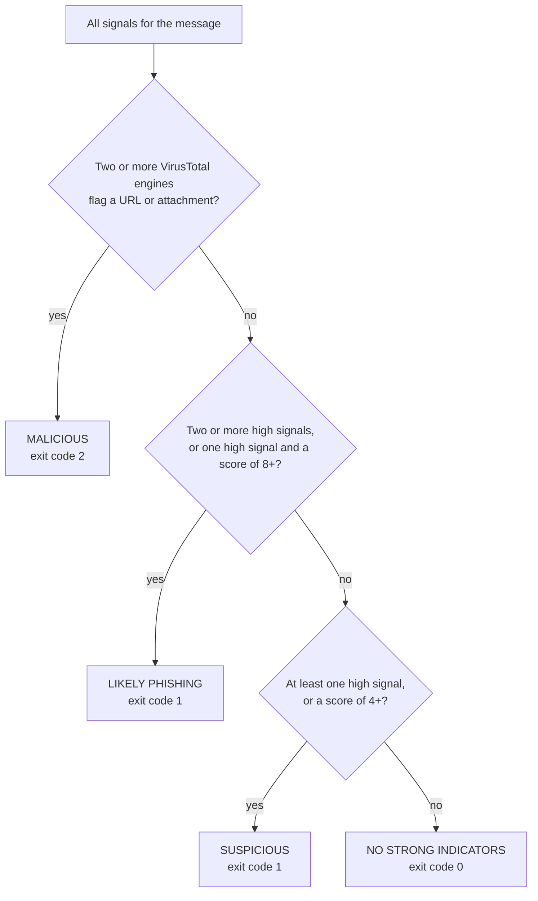

# How PhishHawk decides

This page lists every signal PhishHawk can raise, how the signals become a
verdict, and which MITRE ATT&CK techniques each one evidences. It is written
from the code in `src/phishhawk/heuristics.py`, `lookalike.py` and `models.py`.

- [From signals to a verdict](#from-signals-to-a-verdict)
- [Signal catalogue](#signal-catalogue)
  - [Authentication](#authentication)
  - [Sender and impersonation](#sender-and-impersonation)
  - [Lookalike domains](#lookalike-domains)
  - [Links](#links)
  - [Attachments](#attachments)
  - [HTML attachments](#html-attachments)
  - [Body and language](#body-and-language)
  - [Reputation (enrichment)](#reputation-enrichment)
- [Protected domains](#protected-domains)
- [What gets exported as an indicator](#what-gets-exported-as-an-indicator)
- [Knowledge base](#knowledge-base)

## From signals to a verdict

Every check that fires adds a **signal**: a severity, a plain-language label and
the ATT&CK techniques it is evidence of. Signals are weighted:

| Severity | Weight | Examples |
|---|---|---|
| High | 3 | `SPF=fail`, a homoglyph of your domain, a double extension, HTML smuggling |
| Medium | 2 | `DKIM=none`, a shortened link, credential lure wording |
| Low | 1 | a Return-Path at a bulk-mail provider, a high-abuse TLD, an archive attachment |

The **risk score** is the sum of the weights, except that low signals add
**at most 3 points between them**. Missing authentication headers, bounce
addresses at email service providers and messages with no links are common in
legitimate mail, and they must not add up to a verdict on their own.

**Why two VirusTotal engines?** A single engine flagging a URL is often noise:
one vendor's generic heuristic, or a stale entry. Two independent engines is
the usual SOC threshold for calling something malicious. One engine, or
"suspicious" votes only, raises a medium signal instead.

**A worked example.** The bundled `samples/sample_phish.eml` raises 9 high signals
(27 points), 3 medium (6 points) and 4 low, of which only 3 count. Its score is
therefore 36, and with at least two high signals the verdict is `LIKELY PHISHING`.

## Signal catalogue

Severities marked *varies* depend on context, explained in the notes.

### Authentication

| Signal | Severity | ATT&CK |
|---|---|---|
| `SPF=fail`, `DKIM=fail`, `DMARC=fail` | High | – |
| SPF `softfail`, `none`, `permerror` or `temperror`; DKIM `none`, `permerror` or `temperror`; DMARC `permerror` or `temperror` | Medium | – |
| No `Authentication-Results` header present | Low | – |

Results are read from the `Authentication-Results` header your mail server
added. Passing authentication is **not** treated as proof of legitimacy: an
attacker who registers a lookalike domain can pass SPF, DKIM and DMARC.

### Sender and impersonation

| Signal | Severity | ATT&CK |
|---|---|---|
| Reply-To domain differs from the From domain | High | T1656 |
| Display name claims a brand (`Microsoft Account Team`) the domain does not back up | High | T1656 |
| Display name shows a different email address | Medium | T1656 |
| Display name reads as an organisation, address is free-mail (`HR Payroll <x@gmail.com>`) | Medium | T1656 |
| Subject poses as a brand's notice, but neither the sender nor any link belongs to that brand | *varies*: High with a credential ask and links, else Medium | T1656 |
| Forwarded original: display name claims a brand the address does not back up | High | T1656 |
| Forwarded original: an organisation writes from free-mail | Medium | T1656 |
| Return-Path domain differs from the From domain | Low | – |

Brand matching ignores punctuation, spaces and case, so `Trust-Wallet`,
`Trust Wallet` and `TRUSTWALLET` all match `trustwallet`.

### Lookalike domains

Every domain in the From, Reply-To and Return-Path addresses and every URL host
is compared with 66 well-known brands and with your
[protected domains](#protected-domains).

| Method | Example (target) | How it is found | Severity |
|---|---|---|---|
| **homoglyph** | `micros0ft.com`, `rnicrosoft.com`, `paypa1.com`, `xn--pypal-4ve.com` (Cyrillic `а` in place of Latin `a`) | The label is reduced to "skeletons" that fold look-alike characters (`0→o`, `1→l` or `i`, `3→e`, `5→s`, `rn→m`, `vv→w`, `cl→d`, Cyrillic `а е о р с у х і`), accents removed, then compared | High |
| **typosquat** | `microsfot.com`, `paypai.com`, `exmaple-corp.co.uk` | One typo (insertion, deletion, substitution or swapped letters) from a brand; up to two from a protected domain of 8+ characters | High |
| **combosquat** | `paypal-support.com`, `example-payments.com` | The brand or your domain appears inside a longer label | Medium; High for your own domain |
| **subdomain** | `paypal.com.secure-login.top`, `login.microsoft.verify-account.xyz` | A brand domain used as a subdomain of an unrelated domain | High |
| **tld-swap** | `example.co` vs `example.com` | Same name, different suffix | Medium, because organisations often own several TLDs of their name |

Each lookalike raises a signal tagged T1583.001 (Acquire Infrastructure:
Domains) and T1656 (Impersonation); homoglyphs are also tagged T1036
(Masquerading). URLs on a lookalike host are marked as flagged in every report.

### Links

URLs are collected from the plain-text and HTML bodies, `href` and `src`
attributes, form actions, `meta refresh` tags, JavaScript redirects, the
`List-Unsubscribe` header, HTML attachments and PDF link annotations. Security
gateway rewrites (Microsoft Safe Links, Proofpoint URL Defense, Barracuda) are
unwrapped to the real target first, and open redirects on trusted sites
(Google, Bing, Facebook, YouTube, LinkedIn) are decoded.

| Signal | Severity | ATT&CK |
|---|---|---|
| Link text shows one domain, the `href` goes to another | High | T1036, T1566.002 |
| URL host is a raw IP address | High | T1608.005 |
| Punycode (`xn--`) URL host | High | T1583.001 |
| `@` in the URL hides the real host (`https://microsoft.com@evil.top/`) | High | T1036 |
| URL shortener | Medium | T1608.005 |
| A security-gateway rewrite or an open redirect on a trusted site leads to an untrusted destination | Medium | T1608.005 |
| Link to a tunnel or IPFS gateway (ngrok, trycloudflare, `ipfs.io` …) | Medium | T1583.006 |
| Link to free hosting, a form builder or file sharing | Low | T1583.006 |
| High-abuse TLD (`.top`, `.xyz`, `.zip`, `.click` …) | Low | T1583.001 |
| Credential-harvesting path (`/login`, `/verify`, `/owa` …) on an untrusted host | Low | T1598.003 |

### Attachments

Every attachment is hashed (MD5, SHA-1, SHA-256) and typed by its **magic
bytes**, not by its name or declared content type.

| Signal | Severity | ATT&CK |
|---|---|---|
| Risky type: `.html`, `.htm`, `.js`, `.vbs`, `.hta`, `.lnk`, `.iso`, `.img`, `.one`, `.exe`, `.svg`, `.docm` … (37 extensions) | High | T1566.001, T1204.002 |
| Double extension (`invoice.pdf.js`) | High | T1036.007 |
| Right-to-left override character (U+202E) in the name, so `invoice_[RLO]fdp.exe` displays as `invoice_exe.pdf` | High | T1036.002 |
| Content contradicts the extension (`Scan.pdf` that is really HTML) | High | T1036.008 |
| Office document that contains a VBA macro project | High | T1204.002 |
| Password-protected archive | High | T1027.013 |
| Encrypted archive hides a risky file | High | T1566.001, T1204.002 |
| Any archive attachment (ZIP, RAR, 7z, CAB …) | Low | T1566.001 |

ZIP archives are opened **in memory**: the listing, hashes and types of the
files inside are reported, and the same checks run on them. Caps protect
against zip bombs: 200 members, 25 MB per member, 100 MB in total.

### HTML attachments

| Signal | Severity | ATT&CK |
|---|---|---|
| Credential form: a password field, reported with the host the form posts to | High | T1598.002 |
| HTML smuggling: two or more of `atob`, `new Blob`, `createObjectURL`, `msSaveOrOpenBlob`, `Uint8Array`, `unescape`, `eval`, `document.write`, `fromCharCode` | High | T1027.006 |
| A base64 string decodes to a URL | High | T1027 |
| The attachment redirects the browser (`meta refresh`, `location.href =`, `location.replace()`) | Medium | T1608.005 |

### Body and language

Lure phrases are matched in English, Spanish, Portuguese, French and German,
also with whitespace squeezed out so `v e r i f y` still matches.

| Signal | Severity | ATT&CK |
|---|---|---|
| Advance-fee or extortion wording | High with 2+ phrases, else Medium | T1566 |
| Credential, delivery, payment or prize wording, or Portuguese, Spanish, German or French lure wording | Medium with 2+ phrases, else Low | T1566 |
| Callback phishing: a fake renewal or order plus a phone number | High with no links or from free-mail, else Medium | T1566, T1656 |
| QR-code lure: "scan the code" plus an image | High with no links and an MFA or credential ask, else Medium | T1566.002 |
| Free-mail sender asks for money or gift cards, with no links (BEC) | Medium | T1656 |
| Text split into single letters to dodge keyword filters | Medium | T1027 |
| Three or more zero-width characters hidden in the body | Medium | T1027 |
| Greets the recipient by email address instead of by name | Low | T1566 |
| Random mixed-case token in the subject (hash-busting) | Low | T1027 |
| Recipient's address pasted into the subject | Low | T1566 |
| No URLs or attachments at all (possible BEC or reply-chain lure) | Low | T1656 |

### Reputation (enrichment)

These need network access and, for VirusTotal and AbuseIPDB, an API key.

| Signal | Severity | ATT&CK |
|---|---|---|
| VirusTotal: 2+ engines flag a URL | High, and the verdict becomes `MALICIOUS` | T1566.002, T1204.001 |
| VirusTotal: 2+ engines flag an attachment | High, and the verdict becomes `MALICIOUS` | T1566.001, T1204.002 |
| VirusTotal: minority detections on a URL or file | Medium | T1566.002 or T1566.001 |
| urlscan.io: earlier scans of the host were judged malicious | Medium | T1608.005 |
| RDAP: a domain was registered under 30 days ago | High | T1583.001 |
| RDAP: a domain is under 90 days old | Medium | T1583.001 |
| AbuseIPDB: the sending IP has an abuse confidence of 75% or more | High | – |
| AbuseIPDB: 25% to 74% | Medium | – |

## Protected domains

A protected domain is one that belongs to you. PhishHawk:

- flags lookalikes of it with the label **YOUR domain**, at high severity for
  homoglyphs, typosquats and combosquats;
- never sends it to any reputation service;
- never exports it as an indicator to block.

Protected domains come from `--protect`, from `PHISHHAWK_PROTECT`, and
automatically from the recipients' addresses, because a lookalike of the
recipient's own domain is the classic BEC pattern. `--no-auto-protect` turns
off the automatic part, for example for mail sent to a free-mail inbox.

## What gets exported as an indicator

The indicator list (`iocs` in JSON, the STIX indicators, the CSV rows and the
Markdown table) is built for blocking. It is empty when the verdict is
`NO STRONG INDICATORS`, and it leaves out things that would do harm if blocked:

| Indicator | Exported when |
|---|---|
| URL | Its host is not a well-known brand or a protected domain. Links on hosting and file-sharing platforms (Google Drive, Dropbox …) **are** exported, so the specific link can be blocked without blocking the platform. |
| Domain | The sender, Reply-To, Return-Path or URL host, unless it is a well-known brand, a protected domain, a URL shortener, a free-mail provider, or a free-hosting or file-sharing platform |
| IPv4 | A URL host that is an IP address, and the originating IP |
| Email address | The sender and Reply-To addresses, unless on a well-known brand or protected domain |
| SHA-256 | Every attachment that is not an inline image, including files inside archives |

## Knowledge base

The lists behind the checks live in `src/phishhawk/knowledge.py` and
`src/phishhawk/hosting.py`:

| List | Size | Used for |
|---|---|---|
| Brands | 66 | Lookalike and display-name checks |
| Lure phrases | 9 categories in 5 languages | Language signals |
| High-abuse TLDs | 30 | TLD signal |
| URL shorteners | 32 | Shortener signal, export policy |
| Free-mail providers | 22 | BEC and organisation-name checks, export policy |
| Risky extensions | 37 | Attachment signal |
| Free hosting, tunnels, IPFS gateways, file sharing | 27, 8, 5, 15 | Hosting signals, export policy |

To add to them, or to add a new check, see [CONTRIBUTING.md](../CONTRIBUTING.md).
