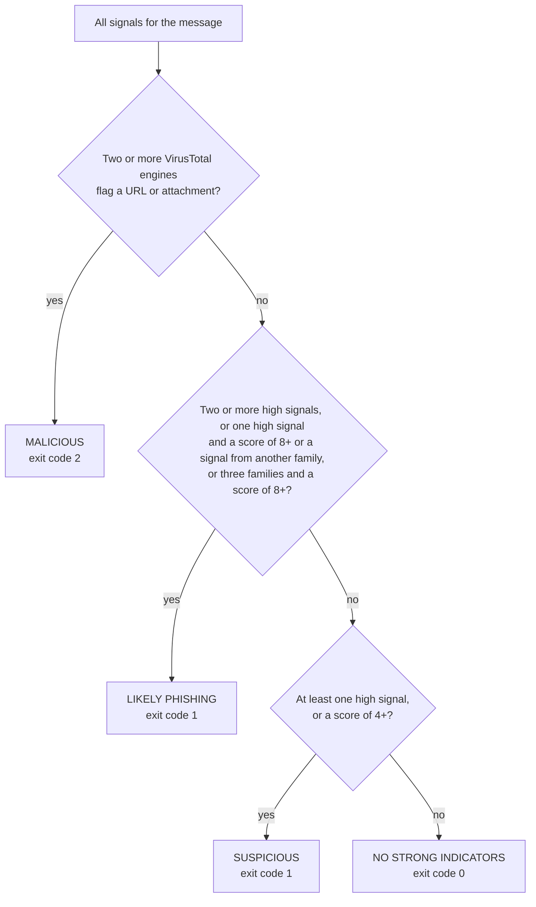

# How PhishHawk decides

This page lists every signal PhishHawk can raise, how the signals become a
verdict, and which MITRE ATT&CK techniques each one evidences. It is written
from the code in `src/phishhawk/heuristics.py`, `lookalike.py` and `models.py`.

- [From signals to a verdict](#from-signals-to-a-verdict)
- [Signal catalogue](#signal-catalogue)
  - [Authentication](#authentication)
  - [Sender and impersonation](#sender-and-impersonation)
  - [Lookalike domains](#lookalike-domains)
  - [Links](#links)
  - [QR codes](#qr-codes)
  - [Attachments](#attachments)
  - [Archives and disk images](#archives-and-disk-images)
  - [Documents, shortcuts and OneNote](#documents-shortcuts-and-onenote)
  - [HTML and SVG attachments](#html-and-svg-attachments)
  - [Calendar invitations](#calendar-invitations)
  - [Hidden text and filter evasion](#hidden-text-and-filter-evasion)
  - [Body and language](#body-and-language)
  - [Money: wallets and business email compromise](#money-wallets-and-business-email-compromise)
  - [Message structure](#message-structure)
  - [Your own lists and rules](#your-own-lists-and-rules)
  - [Carrier emails](#carrier-emails)
  - [Reputation (enrichment)](#reputation-enrichment)
- [Protected domains](#protected-domains)
- [What gets exported as an indicator](#what-gets-exported-as-an-indicator)
- [Knowledge base](#knowledge-base)

## From signals to a verdict

Every check that fires adds a **signal**: a severity, a plain-language label and
the ATT&CK techniques it is evidence of. Signals are weighted:

| Severity | Weight | Examples |
|---|---|---|
| High | 3 | `SPF=fail`, a homoglyph of your domain, a double extension, HTML smuggling |
| Medium | 2 | `DKIM=none`, a shortened link, credential lure wording |
| Low | 1 | a high-abuse TLD, a link to free hosting, an archive attachment |

The **risk score** is the sum of the weights, except that low signals add
**at most 3 points between them, one per kind**. Each low signal is common in
legitimate mail too, and several of them must not add up to a verdict on their
own: a newsletter's links to a dozen sign-in pages are one weak finding, not a
dozen. Two checks 1.x scored as low (a Return-Path that differs from the
sender, and a message with no links) were removed in 2.0: on real mail they
fired more often on legitimate messages than on phishing.

Since 2.1 every signal also has a **family**, the part of the message it is
about: `auth` (SPF, DKIM, DMARC, a forged brand sender), `sender`, `link`,
`attachment`, `content` (lure wording), `evasion` (tricks aimed at filters),
`intel` (reputation lookups) and `policy` (your block list, your YARA rules).
Two findings from different families are independent evidence; DKIM and DMARC
failing together are one finding seen twice. A high signal **backed by** a
medium or high signal from another family is enough for `LIKELY PHISHING`, and
so are medium signals from **three families** with a score of 8 or more. The
JSON report carries each signal's family.

```mermaid
flowchart TD
    A["All signals for the message"] --> B{"Two or more VirusTotal engines<br/>flag a URL or attachment?"}
    B -- yes --> M["MALICIOUS<br/>exit code 2"]
    B -- no --> C{"Two or more high signals, or one high signal<br/>and a score of 8+ or a signal from another family,<br/>or three families and a score of 8+?"}
    C -- yes --> L["LIKELY PHISHING<br/>exit code 1"]
    C -- no --> D{"At least one high signal,<br/>or a score of 4+?"}
    D -- yes --> S["SUSPICIOUS<br/>exit code 1"]
    D -- no --> N["NO STRONG INDICATORS<br/>exit code 0"]
```

**Why two VirusTotal engines?** A single engine flagging a URL is often noise:
one vendor's generic heuristic, or a stale entry. Two independent engines is
the usual SOC threshold for calling something malicious. One engine, or
"suspicious" votes only, raises a medium signal instead.

**A worked example.** The bundled `samples/sample_phish.eml` raises 9 high signals
(27 points), 3 medium (6 points) and 3 low signals of 2 kinds (2 points). Its
score is therefore 35, and with at least two high signals the verdict is
`LIKELY PHISHING`.

**Authentication, explained.** Next to the signals, every report since 2.2
carries an authentication block for the analyst: `pass`, `fail` or `unknown`
for the domain the reader sees in From, which domain SPF, DKIM and DMARC each
vouched for, and whether it is aligned with From (the same organisation, as
DMARC's relaxed mode counts it). The receiver's DMARC result always wins; with
none, an aligned SPF or DKIM pass decides. The block explains and never
scores: the authentication signals in the catalogue below are what count.

**Registrable domains.** Lookalike checks, the export policy and campaign
correlation work on the registrable domain (`paypal-login.com.ar`, not
`www.paypal-login.com.ar`). With `--psl`, the Public Suffix List decides it.
Without one, a built-in approximation knows the common two-part suffixes
(`co.uk`, `com.au` ...) and, since 2.2, takes `com`, `net`, `org`, `edu`,
`gov`, `co`, `ac`, `or`, `ne`, `go`, `gob`, `gouv`, `mil`, `nom`, `sch`, `ltd`
and `plc` under any two-letter country code as the registry's own
(`com.ar`, `co.th`, `ne.jp`, `gouv.fr`).

## Signal catalogue

Severities marked *varies* depend on context, explained in the notes. *none* in the
ATT&CK column means the signal counts towards the verdict but evidences no
single technique on its own.

### Authentication

| Signal | Severity | ATT&CK |
|---|---|---|
| `SPF=fail`, `DKIM=fail`, `DMARC=fail` | High | none |
| SPF `softfail`, `none`, `permerror` or `temperror`; DKIM `none`, `permerror` or `temperror`; DMARC `permerror` or `temperror` | Medium | none |
| Forged `Authentication-Results`: a pass claimed below the receiving server's own results, in that server's name | Medium | T1036 |
| An earlier `Authentication-Results` header from another server claims a pass (ignored) | Low | none |

Results are read from the `Authentication-Results` header your mail server
added: the block at the top of the message, which is one header or, as
ProtonMail writes it, one per check under the same server name. A header
further down was written before the message reached your server, so a pass
it claims is never believed. `--trusted-authserv` names your server outright. A message with no such header is not scored: the header is missing from
mail exported by many clients and from all older mail, phishing or not. Passing authentication is **not** treated as proof of legitimacy: an
attacker who registers a lookalike domain can pass SPF, DKIM and DMARC.

### Sender and impersonation

| Signal | Severity | ATT&CK |
|---|---|---|
| Reply-To domain differs from the From domain | High; Medium on mailing-list mail | T1656 |
| Reply-To goes to the mailing list the message came through | Low | none |
| Display name claims a brand (`Microsoft Account Team`) the domain does not back up. A brand's name on a country domain (`paypal.de`, `amazon.co.jp`, `lidl.fr`) counts as its own, except on a TLD sold as a generic one (`.co`, `.io`) or a high-abuse one | High | T1656 |
| The From address is a whole address in quotes with no domain of its own (`<"service@adac.de">`), which a mail client shows but no server checked, or a quoted address in front of the real domain (`"billing@bank.example"@evil.top`) | High | T1656, T1036 |
| The sender's address is on free web hosting (`no-reply@x.firebaseapp.com`), where anyone can pick the name | Medium | T1585.002 |
| Display name shows a different email address | Medium | T1656 |
| Display name reads as an organisation, address is free-mail (`HR Payroll <x@gmail.com>`) | Medium | T1656 |
| Subject poses as a brand's notice, but neither the sender nor any link belongs to that brand | *varies*: High with a credential ask and links, else Medium | T1656 |
| Forwarded original: display name claims a brand the address does not back up | High | T1656 |
| Forwarded original: an organisation writes from free-mail | Medium | T1656 |
| The From address uses a brand's domain, but DKIM does not pass and DMARC fails or is missing: the From line is probably forged | High | T1656, T1036 |
| Display name imitates a brand with look-alike characters (`PayPaI`, `Amaz0n`, `Iedger`) and the domain is not the brand's | High | T1656, T1036 |
| The subject or display name spells a brand with look-alike characters | High | T1036, T1656 |
| Display name mixes alphabets inside a word (Latin with Cyrillic, Greek, Armenian or Cherokee look-alikes). A word in another alphabet with one stray Latin letter (a Russian name typed with one key on the wrong layout) is a typo, not a disguise, and is not flagged | High | T1036 |
| Subject mixes alphabets inside a word | Medium | T1036 |
| Subject written in styled Unicode letters (`𝐔𝐫𝐠𝐞𝐧𝐭`, `Ｖｅｒｉｆｙ`), which keyword filters do not read as text | Medium | T1027 |
| Two or more invisible characters inside the subject. A soft hyphen only counts inside a word (`Pay\u00adPal`): one also turns up when a subject in another charset is decoded as Latin-1 | Medium | T1027 |

Brand matching ignores punctuation, spaces and case, so `Trust-Wallet`,
`Trust Wallet` and `TRUSTWALLET` all match `trustwallet`.

A mailing list sets Reply-To to its own address, which looks exactly like
reply diversion. Mail counts as list mail when it carries `List-Post`,
`Mailing-List`, `X-Mailing-List` or `X-BeenThere`, or `Precedence: list`; if
Reply-To then points at the list's own domain the signal drops to Low. `List-Id`
and `Precedence: bulk` do not count, because every bulk-mail service sets them,
including the ones phishers rent.

### Lookalike domains

Every domain in the From, Reply-To and Return-Path addresses and every URL host
is compared with 134 well-known brands and with your
[protected domains](#protected-domains).

| Method | Example (target) | How it is found | Severity |
|---|---|---|---|
| **homoglyph** | `micros0ft.com`, `rnicrosoft.com`, `paypa1.com`, `xn--pypal-4ve.com` (Cyrillic `а` in place of Latin `a`) | The label is reduced to "skeletons" that fold look-alike characters (`0→o`, `1→l` or `i`, `3→e`, `5→s`, `rn→m`, `vv→w`, `cl→d`, Cyrillic `а е о р с у х і`), accents removed, then compared | High |
| **typosquat** | `microsfot.com`, `paypai.com`, `exmaple-corp.co.uk`, `micros-oft.com` | One typo (insertion, deletion, substitution or swapped letters) from a brand, or the name split by a hyphen; up to two typos from a protected domain of 8+ characters | High |
| **combosquat** | `paypal-support.com`, `outlooksecure.com`, `example-corp-payroll.com`, `paypal-com.top`, `www-paypal.com` | The brand or your domain plus only lure or business words (`secure`, `login`, `billing`, `payroll`, `taxa`...), a spelled-out domain word (`com`, `www`, `net`...), digits or a two-letter code. A name that merely appears inside another (`linuxmafia.com`, `yahoogroups.com`) does not count | Medium; High for your own domain |
| **subdomain** | `paypal.com.secure-login.top`, `login.microsoft.verify-account.xyz` | A brand used as a subdomain of an unrelated domain | High when the brand's whole domain is spelled out, the site is on a high-abuse TLD or free hosting, or its name holds a credential word; otherwise Medium (`outlook.4team.biz`) |
| **tld-swap** | `example.co` vs `example.com`, `slack.net` | Same name, different suffix. A brand's name under an established country domain (`yahoo.co.uk`, `santander.com.br`) is taken as the brand's own site | Medium, because organisations often own several TLDs of their name |

Each lookalike raises a signal tagged T1583.001 (Acquire Infrastructure:
Domains) and T1656 (Impersonation); homoglyphs are also tagged T1036
(Masquerading). URLs on a lookalike host are marked as flagged in every report.

### Links

URLs are collected from the plain-text and HTML bodies, `href` and `src`
attributes, form actions, `meta refresh` tags, JavaScript redirects, the
`List-Unsubscribe` header, HTML attachments and PDF link annotations. Security
gateway rewrites (Microsoft Safe Links, Proofpoint URL Defense, Barracuda) are
unwrapped to the real target first, and open redirects on trusted sites
(Google, Bing, Facebook, YouTube, LinkedIn) are decoded.

Newsletters show their own site and link through a click tracker, so a plain
mismatch is Medium and one tracker counts once, however many links use it. An
email address in the link text names a mailbox, not a website, and is ignored.

| Signal | Severity | ATT&CK |
|---|---|---|
| Link downloads a runnable file (`.exe`, `.js`, `.hta`, `.iso`, `.lnk`, `.msi`, `.ps1`, `.one` … 22 types) | High | T1204.001, T1566.002 |
| Link downloads an archive (`.zip`, `.rar`, `.7z`, `.gz` …) | Medium | T1204.001, T1566.002 |
| Link text shows one domain, the `href` goes to another | High when the text shows a brand, government, free-mail or your own domain, or the destination is itself suspect (raw IP, lookalike, shortener, high-abuse TLD, free hosting); otherwise Medium, counted once per destination | T1036, T1566.002 |
| URL host is a raw IP address, IPv4 or IPv6 | High | T1608.005 |
| URL writes an IP address as one number, in hex or in octal (`http://3232235777/` is `192.168.1.1`), read the way browsers read it | High | T1027, T1608.005 |
| Punycode (`xn--`) URL host | High | T1583.001 |
| `@` in the URL hides the real host (`https://microsoft.com@evil.top/`) | High | T1036 |
| URL shortener | Medium | T1608.005 |
| A security-gateway rewrite or an open redirect on a trusted site leads to an untrusted destination | Medium | T1608.005 |
| Link to a tunnel or IPFS gateway (ngrok, trycloudflare, `ipfs.io` …) | Medium | T1583.006 |
| Link to free hosting, a form builder or file sharing | Low | T1583.006 |
| High-abuse TLD (`.top`, `.xyz`, `.zip`, `.click` …) | Low | T1583.001 |
| Credential-harvesting path (`/login`, `/verify`, `/owa` …) on an untrusted host, in a link the reader can click (not an image or a style sheet) | Low | T1598.003 |
| A link that runs JavaScript (`javascript:`) instead of opening a website | Medium | T1027.006 |
| A link that opens a page built into the link itself (`data:text/html`, `data:image/svg+xml`) | High | T1027.006, T1566.002 |

Tabs and line breaks inside an `href` are dropped the way browsers drop them,
so `https://ev&#10;il.top` is read as `evil.top`.
### QR codes

A QR code is scanned on a phone, away from the mail gateway and the desktop's
link checks. With the optional extra installed (`pip install 'phishhawk[qr]'`),
codes are decoded wherever attackers put them: image attachments and inline
images, images embedded in the HTML as `data:` URIs, images inside PDFs (JPEG,
Flate with or without PNG predictors, CCITT fax), and codes drawn with HTML table
cells or with block characters (`█ ▀ ▄`), which contain no image at all. The
link a code holds is analysed like any other link: lookalikes, hosting,
reputation.

| Signal | Severity | ATT&CK |
|---|---|---|
| QR code links somewhere | High when the link is suspect (raw IP, shortener, free hosting or tunnel, high-abuse TLD, lookalike, login path, your address in the link) or the message asks for credentials or MFA; Low when it leads to the sender's own domain and DMARC passes; otherwise Medium | T1566.002 |
| QR code calls or texts a number (`tel:`, `sms:`) | Medium | T1566 |

### Attachments

Every attachment is hashed (MD5, SHA-1, SHA-256) and typed by its **magic
bytes**, not by its name or declared content type.

| Signal | Severity | ATT&CK |
|---|---|---|
| Risky type: `.html`, `.htm`, `.js`, `.vbs`, `.hta`, `.lnk`, `.iso`, `.img`, `.one`, `.exe`, `.svg`, `.docm` … (37 extensions) | High | T1566.001, T1204.002 |
| Double extension (`invoice.pdf.js`) | High | T1036.007 |
| Right-to-left override character (U+202E) in the name, so `invoice_[RLO]fdp.exe` displays as `invoice_exe.pdf` | High | T1036.002 |
| Content contradicts the extension (`Scan.pdf` that is really HTML) | High | T1036.008 |
| Macro-enabled document (`.docm`, `.xlsm` …, or any Office file holding a VBA project) | High | T1204.002, T1059.005 |

Files inside archives, disk images, documents, OneNote sections, `winmail.dat`
and attached emails are extracted **in memory** and checked like attachments of
their own, down to three levels (`zip → iso → lnk`). Nothing is written to disk
or run. Caps keep hostile files cheap: 400 files and 200 MB per message, 200
members and 100 MB per archive, 25 MB per file, and read budgets on every
reader so that entries pointing at the same bytes cannot multiply them.

### Archives and disk images

ZIP, gzip and tar are opened. 7z members are decompressed in memory (LZMA and
LZMA2 behind any branch or delta filter, Deflate, BZip2 and stored), up to 64
MB per archive; encrypted 7z folders are listed only. Everything a message's
archives and disk images decompress or read shares one 256 MB budget. RAR's own compression is proprietary, so a RAR (4 or 5) has its stored
members read and the rest listed from its headers. ISO 9660 (with Joliet
names), FAT12, FAT16 and FAT32 images, and VHD (fixed, dynamic and
differencing) and VHDX virtual disks are opened: their MBR or GPT partitions
are found, and the files on every FAT or NTFS volume extracted, with every read
counted against a budget so that a block table pointing at one block cannot
multiply it. A ZIP locked with ZipCrypto is opened when the message itself
gives the password. Every extracted file is inspected like an attachment.

| Signal | Severity | ATT&CK |
|---|---|---|
| Disk image (`.iso`, `.img`, `.vhd`, `.vhdx`) delivers files without the Mark of the Web, so SmartScreen and Office's block on internet macros never see them. A virtual disk is flagged even when it cannot be read | High | T1553.005, T1566.001 |
| The message gives the password for its archive or file, so no gateway could look inside | High | T1027.013, T1566.001 |
| Archive encrypts even its file names (RAR `-hp`, 7z with an encrypted header) | High | T1027.013 |
| Password-protected archive | High | T1027.013 |
| Archive or disk image holds a risky file or a double extension (named even when encrypted) | High | T1566.001, T1204.002 |
| Any other archive attachment | Low | T1566.001 |

### Documents, shortcuts and OneNote

Office files (OOXML and legacy OLE2), PDFs, RTF, Windows shortcuts (`.lnk`) and
OneNote sections are read for what they would do when opened.

| Signal | Severity | ATT&CK |
|---|---|---|
| Shortcut starts a command interpreter or script host (`cmd`, `powershell`, `mshta`, `wscript` …), runs an encoded PowerShell command, downloads from the internet, hides a long command line behind padding, or opens minimised with arguments | High | T1204.002; T1059.001 for PowerShell, T1218.005 for mshta |
| Excel 4.0 (XLM) macro sheets | High | T1204.002 |
| A DDE field runs a command on opening | High | T1559.002, T1204.002 |
| External link through a Windows protocol handler (`ms-msdt:`, `search-ms:` …: the Follina family) | High | T1203, T1221 |
| Remote template, OLE object, frame or subdocument loaded on opening | High | T1221 |
| Embedded file in an OLE Package object | High | T1204.002 |
| ActiveX controls | Medium | T1204.002 |
| Password-protected Office document | Medium | T1027.013 |
| PDF launch action that starts a program | High | T1204.002 |
| PDF JavaScript | High when it runs on opening, else Medium | T1059.007, T1204.002 |
| PDF carries an embedded file | Medium | T1027, T1204.002 |
| PDF form that submits what is typed into it | Medium | T1598.002 |
| RTF Equation Editor object (CVE-2017-11882) | High | T1203 |
| RTF OLE object of a class used by known exploits (`htmlfile`, `OTKLOADR`) | High | T1203 |
| RTF remote template | High | T1221 |
| RTF embedded file (Package object) | High | T1204.002 |
| Other embedded OLE objects in an RTF, noting any that update on opening | Medium | T1204.002 |
| OneNote section hides a runnable file (the 2023 "double-click to view" wave) | High; Medium for other embedded files | T1204.002, T1027 |

### HTML and SVG attachments

| Signal | Severity | ATT&CK |
|---|---|---|
| SVG image runs JavaScript (SVG smuggling) | High | T1027.006, T1059.007 |
| Credential form: a password field, reported with the host the form posts to | High | T1598.002 |
| HTML smuggling: two or more of `atob`, `new Blob`, `createObjectURL`, `msSaveOrOpenBlob`, `Uint8Array`, `unescape`, `eval`, `document.write`, `fromCharCode` | High | T1027.006 |
| A base64 string decodes to a URL | High | T1027 |
| The attachment redirects the browser (`meta refresh`, `location.href =`, `location.replace()`) | Medium | T1608.005 |

### Calendar invitations

Invitations (`.ics` attachments, `text/calendar` parts and invitations inside
`winmail.dat`) are read for their organiser, links and attachments; the links
are analysed like any other.

| Signal | Severity | ATT&CK |
|---|---|---|
| The invitation's organiser is not the sender | Medium | T1656 |
| The invitation carries links | Low | T1566.002 |

### Hidden text and filter evasion

The HTML is read the way a mail client shows it. Text hidden with CSS
(`display:none`, `visibility:hidden`, `mso-hide:all`, zero opacity, a zero or
one-pixel font, zero height or width with `overflow:hidden`, inline or through
a style-sheet class) is separated from the visible text, and both are kept:
lures hide in preheaders.

| Signal | Severity | ATT&CK |
|---|---|---|
| Hidden text breaks up visible words (`PayxqPal`) so filters read something else than the reader | High at two or more places, Medium for one | T1027 |
| Words broken up with HTML tags one piece at a time | Medium | T1027 |
| Hidden filler: text the reader never sees, unrelated to the visible text | Medium | T1027 |
| Three or more zero-width characters in the body | Medium | T1027 |
| Text split into single letters (`v e r i f y`) | Medium | T1027 |
| Random mixed-case token in the subject (hash-busting) | Low | T1027 |

### Body and language

Lure phrases are matched in English, Spanish, Portuguese, French, German,
Dutch and Italian,
also with whitespace squeezed out so `v e r i f y` still matches.

| Signal | Severity | ATT&CK |
|---|---|---|
| Advance-fee or extortion wording | High with 2+ phrases, else Medium | T1566 |
| Credential, delivery, payment or prize wording, or Portuguese, Spanish, German or French lure wording | Medium with 2+ phrases, else Low | T1566 |
| Callback phishing: a fake renewal or order plus a phone number | High with no links or from free-mail, else Medium | T1566.004, T1656 |
| QR-code lure: "scan the code" plus an image | High with no links and an MFA or credential ask, else Medium | T1566.002 |
| Greets the recipient by email address instead of by name | Low | T1566 |
| Recipient's address pasted into the subject | Low | T1566 |

The lure categories are credentials, delivery, payment, prizes, advance fee,
extortion, callback, QR code, crypto-wallet recovery, casino bonuses, and a
foreign-language set.

### Money: wallets and business email compromise

Bitcoin, Litecoin and TRON addresses are reported only when their checksum
holds, so a random token is never taken for a wallet; Ethereum and Monero
addresses are matched by shape. Wallets and callback numbers are exported as
indicators.

| Signal | Severity | ATT&CK |
|---|---|---|
| Asks for payment to a crypto wallet (extortion, fake investment) | High | T1657 |
| A wallet address appears in the message | Low | T1657 |
| A lookalike of **your** domain asks for money (invoice, wire, gift cards) | High | T1656, T1657 |
| A free-mail sender asks for money | Medium | T1656, T1657 |

### Message structure

| Signal | Severity | ATT&CK |
|---|---|---|
| MIME parts nested deeper than 15 levels; 19,458 real messages never went past 4 | Medium | T1027 |
| MIME nested deeper than a mail parser can follow: the body is read as plain text | High | T1027 |
| More than 1,000 distinct links: the rest are counted, not checked, so a flood cannot bury the real link unnoticed | Medium | T1027 |

### Your own lists and rules

| Signal | Severity | ATT&CK |
|---|---|---|
| The sender, Reply-To, Return-Path or a link is on your block list (`--block`, or `block_domains` in the config file) | High | T1566 |
| One of your YARA rules matches the raw message or any file PhishHawk opened (`--yara`) | Set by the rule's `severity` meta, High by default | Set by the rule's `mitre` meta |

Allowed domains (`--allow`, `allow_domains`) are your partners: they are never
reported as lookalikes and never exported as indicators.

### Carrier emails

When a message is unwrapped to an attached original, the layers around it are
analysed too. If one of them is itself suspicious, which is how an attacker
would hide a phish behind a harmless attached message, each of its signals is
added with the prefix `carrier email:` at its own severity, and its links join
the message's links.

### Reputation (enrichment)

These need network access and, for VirusTotal and AbuseIPDB, an API key.

| Signal | Severity | ATT&CK |
|---|---|---|
| VirusTotal: 2+ engines flag a URL | High, and the verdict becomes `MALICIOUS` | T1566.002, T1204.001 |
| VirusTotal: 2+ engines flag an attachment | High, and the verdict becomes `MALICIOUS` | T1566.001, T1204.002 |
| VirusTotal: minority detections on a URL or file | Medium | T1566.002 or T1566.001 |
| urlscan.io: earlier scans of the host were judged malicious | Medium | T1608.005 |
| RDAP: a domain was registered under 30 days ago | High | T1583.001 |
| RDAP: a domain is under 90 days old | Medium | T1583.001 |
| AbuseIPDB: the sending IP has an abuse confidence of 75% or more | High | none |
| AbuseIPDB: 25% to 74% | Medium | none |

## Protected domains

A protected domain is one that belongs to you. PhishHawk:

- flags lookalikes of it with the label **YOUR domain**, at high severity for
  homoglyphs, typosquats and combosquats;
- never sends it to any reputation service;
- never exports it as an indicator to block.

Protected domains come from `--protect`, from `PHISHHAWK_PROTECT`, and
automatically from the recipients' addresses, because a lookalike of the
recipient's own domain is the classic BEC pattern. A recipient's free-mail
domain (any country's `yahoo`, `hotmail` …) and the documentation domains
`example.com`, `.net` and `.org` are never guessed as yours. `--no-auto-protect`
turns off the automatic part, for example for mail sent to a free-mail inbox.

## What gets exported as an indicator

The indicator list (`iocs` in JSON, the STIX indicators, the CSV rows and the
Markdown table) is built for blocking. It is empty when the verdict is
`NO STRONG INDICATORS`, and it leaves out things that would do harm if blocked:

| Indicator | Exported when |
|---|---|
| URL | Its host is not a well-known brand or a protected domain. Links on hosting and file-sharing platforms (Google Drive, Dropbox …) **are** exported, so the specific link can be blocked without blocking the platform. |
| Domain | The sender, Reply-To, Return-Path or URL host, unless it is a well-known brand, a protected domain, a URL shortener, a free-mail provider, or a free-hosting or file-sharing platform |
| IPv4, IPv6 | A URL host that is an IP address, and the originating IP (exported to MISP as `ip-src`) |
| Email address | The sender and Reply-To addresses, unless on a well-known brand or protected domain |
| SHA-256 | Every attachment that is not an inline image, including files inside archives, disk images and documents |
| Crypto wallet | Every wallet address found (exported to MISP as `btc` or `xmr`) |
| Phone number | A number a callback phish asks the reader to ring |

## Knowledge base

The lists behind the checks live in `src/phishhawk/knowledge.py` and
`src/phishhawk/hosting.py`:

| List | Size | Used for |
|---|---|---|
| Brands | 187, plus any in your config file | Lookalike and display-name checks |
| Lure phrases | 268 in 11 categories, 7 languages, plus any in your config file | Language signals |
| High-abuse TLDs | 30 | TLD signal |
| URL shorteners | 32 | Shortener signal, export policy |
| Free-mail providers | 22 | BEC and organisation-name checks, export policy |
| Risky extensions | 37 | Attachment signal |
| Runnable and archive downloads | 22, 10 | Download-link signals |
| Free hosting, tunnels, IPFS gateways, file sharing | 27, 8, 5, 15 | Hosting signals, export policy |

To add to them, or to add a new check, see [CONTRIBUTING.md](../CONTRIBUTING.md).
