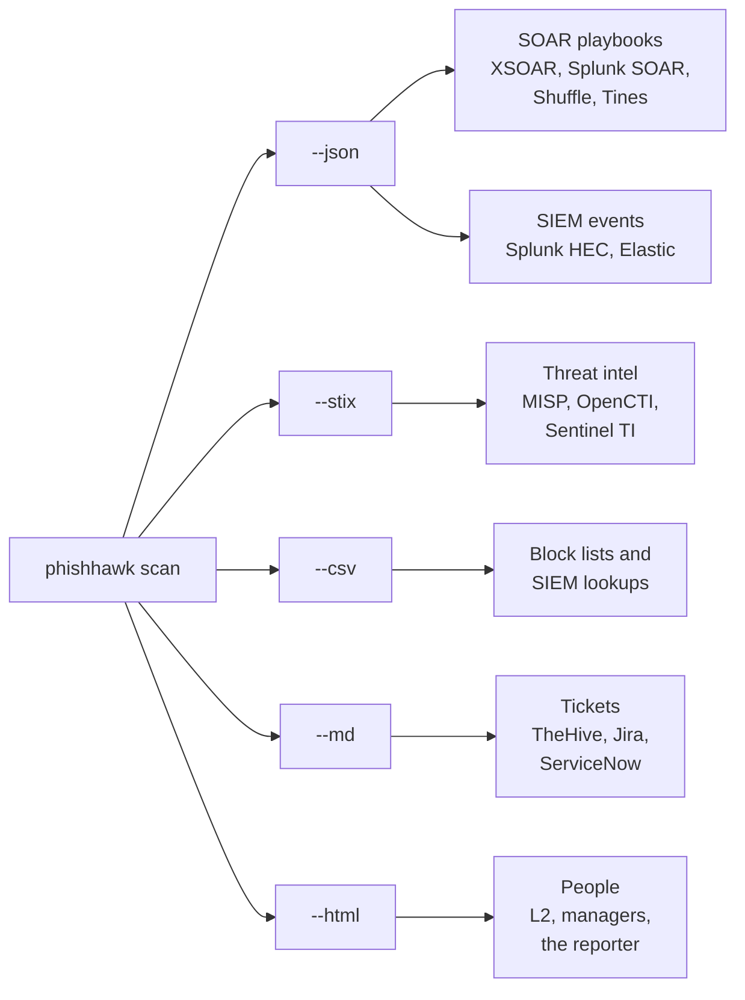

# Integrating PhishHawk

PhishHawk is a command-line tool with machine-readable output, so it fits into
most SOC stacks without a plugin. This page shows the common routes. Each
platform's menus and APIs change between versions, so treat the snippets as
starting points and check them against your own instance.

- [Which export for which tool](#which-export-for-which-tool)
- [Threat-intelligence platforms](#threat-intelligence-platforms)
  - [MISP](#misp)
  - [OpenCTI](#opencti)
  - [Microsoft Sentinel](#microsoft-sentinel)
- [SIEM](#siem)
  - [Splunk](#splunk)
  - [Elastic](#elastic)
- [Case management: TheHive](#case-management-thehive)
- [SOAR playbooks](#soar-playbooks)
- [Polling a phishing-report mailbox](#polling-a-phishing-report-mailbox)
- [Scheduled runs](#scheduled-runs)
- [Using PhishHawk as a Python library](#using-phishhawk-as-a-python-library)

## Which export for which tool



| Export | Shape | Good for |
|---|---|---|
| `--json` | One object per message (or `{"reports": [...]}`) with verdict, signals, techniques, indicators and actions | Anything that makes decisions |
| `--stix` | STIX 2.1 bundle: an `identity`, one `indicator` per IOC, `attack-pattern` objects for the ATT&CK techniques and a `report` per message | Sharing intelligence |
| `--csv` | `type, value, defanged, context, verdict, subject, source_file` | Block lists, lookups, spreadsheets |
| `--md` | Ticket note: headers, key findings, defanged indicator table, ATT&CK, action checklist | Case notes |
| `--html` | Self-contained page with a strict Content-Security-Policy | Attaching to a ticket or email |

STIX indicators carry a `confidence` that follows the verdict (85 for
`MALICIOUS`, 70 for `LIKELY PHISHING`, 40 for `SUSPICIOUS`) and
`indicator_types` of `malicious-activity` or `anomalous-activity`. Object IDs
are derived from the indicator value, so importing the same URL twice updates
one object instead of creating two.

## Threat-intelligence platforms

### MISP

In the web interface, open or create an event and use *Import from… → STIX 2.x*
with the file from `--stix`. Or with [PyMISP](https://github.com/MISP/PyMISP):

```python
from pymisp import PyMISP

misp = PyMISP("https://misp.example.com", "YOUR_API_KEY")
misp.upload_stix("bundle.json", version="2")
```

### OpenCTI

Upload the bundle under *Data → Import* (the STIX file import connector must be
enabled), or push it with [pycti](https://github.com/OpenCTI-Platform/client-python):

```python
from pycti import OpenCTIApiClient

client = OpenCTIApiClient("https://opencti.example.com", "YOUR_API_TOKEN")
client.stix2.import_bundle_from_file("bundle.json")
```

The `report` objects arrive as OpenCTI reports with the indicators and ATT&CK
attack patterns attached.

### Microsoft Sentinel

Sentinel's threat-intelligence page can import indicators from a file (STIX
JSON or CSV). Use the `--stix` bundle, or reshape the CSV to the column layout
your Sentinel version asks for. For a continuous feed, send the JSON output to a
Logic App or Azure Function that calls the threat-intelligence upload API.

## SIEM

### Splunk

**Hunt for clicks.** Load the CSV as a lookup, then search proxy logs for anyone
who visited a reported domain:

```bash
phishhawk scan reported/ --csv phishhawk_iocs.csv
# copy it to $SPLUNK_HOME/etc/apps/search/lookups/, or upload it under
# Settings → Lookups → Lookup table files
```

```spl
index=proxy
    [| inputlookup phishhawk_iocs.csv
     | where type="domain"
     | rename value AS dest_host
     | fields dest_host]
| stats count values(user) AS users BY dest_host
```

**Index every triage** through the HTTP Event Collector, so verdicts can be
reported on:

```bash
phishhawk scan mail.eml --json - \
  | jq -c '{sourcetype: "phishhawk:triage", event: .}' \
  | curl -sS https://splunk.example.com:8088/services/collector/event \
         -H "Authorization: Splunk $SPLUNK_HEC_TOKEN" --data-binary @-
```

### Elastic

Send one document per triage with the bulk API:

```bash
phishhawk scan reported/ --json - \
  | jq -c '(.reports // [.])[] | {"index": {"_index": "phishhawk"}}, .' \
  | curl -sS -H "Content-Type: application/x-ndjson" -u "$ES_USER:$ES_PASS" \
         -X POST "https://elastic.example.com:9200/_bulk" --data-binary @-
```

## Case management: TheHive

Use the Markdown report as the case or alert description, and turn the JSON
indicators into observables. A minimal sketch for TheHive 5's API:

```python
import json, subprocess, requests

THEHIVE = "https://thehive.example.com"
HEADERS = {"Authorization": "Bearer YOUR_API_KEY"}
DATA_TYPES = {"url": "url", "domain": "domain", "ipv4": "ip", "email": "mail", "sha256": "hash"}

eml = "reported/ticket-4821.eml"
run = subprocess.run(["phishhawk", "scan", eml, "--json", "-", "--no-banner"],
                     capture_output=True, text=True)
report = json.loads(run.stdout)
note = subprocess.run(["phishhawk", "scan", eml, "--md", "-", "--no-banner"],
                      capture_output=True, text=True).stdout

alert = {
    "type": "phishing-report",
    "source": "phishhawk",
    "sourceRef": report["message_id"] or eml,
    "title": "%s: %s" % (report["verdict"], report["subject"]),
    "description": note,
    "severity": {"MALICIOUS": 3, "LIKELY PHISHING": 3, "SUSPICIOUS": 2}.get(report["verdict"], 1),
    "tags": ["phishing"] + [t["id"] for t in report["techniques"]],
    "observables": [{"dataType": DATA_TYPES[i["type"]], "data": i["value"], "message": i["context"]}
                    for i in report["iocs"] if i["type"] in DATA_TYPES],
}
requests.post(THEHIVE + "/api/v1/alert", json=alert, headers=HEADERS, timeout=30).raise_for_status()
```

The second run is served from PhishHawk's cache, so it costs no extra API calls.

## SOAR playbooks

Any SOAR platform that can run a command (Cortex XSOAR, Splunk SOAR, Shuffle,
Tines, n8n …) can drive PhishHawk the same way:

1. Save the reported message as a `.eml` file.
2. Run `phishhawk scan "$EML" --json - --no-banner`.
3. Branch on the **exit code**: `0` close, `1` send to an analyst, `2` open an
   incident, `3` the input was unreadable.
4. Use `iocs[]` for block actions, `recommendations[]` for the task list and
   `techniques[]` for tagging.

```bash
report=$(phishhawk scan "$EML" --json - --no-banner)
status=$?
verdict=$(jq -r .verdict <<<"$report")
case $status in
  0) echo "close: $verdict" ;;
  1) echo "assign to analyst: $verdict" ;;
  2) echo "open incident: $verdict" ;;
  *) echo "could not analyse $EML" >&2 ;;
esac
```

## Polling a phishing-report mailbox

Many organisations route "Report phishing" clicks to a shared mailbox. This
sketch reads new reports over IMAP and triages each one. It runs offline;
add an enricher as shown in [the library section](#using-phishhawk-as-a-python-library)
for reputation lookups.

```python
import imaplib, os
from phishhawk.pipeline import Options, triage_bytes

imap = imaplib.IMAP4_SSL("imap.example.com")
imap.login(os.environ["REPORT_USER"], os.environ["REPORT_PASSWORD"])
imap.select("INBOX")
_, found = imap.search(None, "UNSEEN")
for number in found[0].split():
    _, parts = imap.fetch(number, "(RFC822)")
    analysis = triage_bytes(parts[0][1], path="imap:%s" % number.decode(),
                            options=Options(protected=["example.com"]))
    print(analysis.verdict, analysis.score, analysis.subject)
imap.logout()
```

Because users usually report the phish **as an attachment**, PhishHawk analyses
the attached original and records who reported it in `reported_by`.

## Scheduled runs

A script that triages each new file in a drop folder, keeps one HTML and CSV
report per message and moves the message out of the way:

```bash
#!/usr/bin/env bash
# /srv/phishing/triage.sh, run from cron:  */15 * * * *  /srv/phishing/triage.sh
cd /srv/phishing || exit 1
for eml in inbox/*.eml; do
  [ -e "$eml" ] || continue
  name=$(basename "$eml" .eml)
  phishhawk scan "$eml" --quiet --no-banner \
    --html "out/$name.html" --csv "out/$name.csv" >> phishhawk.log 2>&1
  mv "$eml" done/
done
```

The cache makes repeated runs cheap: an indicator already looked up in the last
24 hours costs nothing.

## Using PhishHawk as a Python library

The command line is the stable interface. The Python API below is what the CLI
itself uses and is handy for scripts, but it may change between minor versions.

```python
from phishhawk.pipeline import Options, triage_file
from phishhawk.report.common import to_dict

analysis = triage_file("suspicious.eml", Options(protected=["example.com"]))
print(analysis.verdict, analysis.score)          # LIKELY PHISHING 32
for signal in analysis.signals:
    print(signal.severity, signal.label, signal.techniques)
for ioc in analysis.iocs():
    print(ioc["type"], ioc["value"])
report = to_dict(analysis)                       # the same dict as --json
```

With reputation lookups and the shared cache:

```python
import os
from phishhawk.cache import Cache, default_cache_path
from phishhawk.enrich import Enricher, Rdap, VirusTotal
from phishhawk.pipeline import triage_file

cache = Cache(default_cache_path())
enricher = Enricher(virustotal=VirusTotal(os.environ["VT_API_KEY"], cache=cache),
                    rdap=Rdap(cache=cache))
analysis = triage_file("suspicious.eml", enricher=enricher)
```

`triage_bytes(data, path=...)` does the same for a message already in memory.
